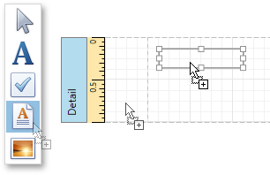
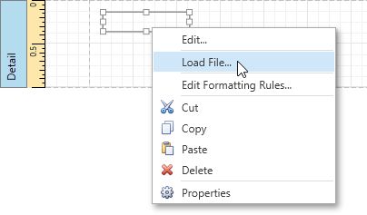
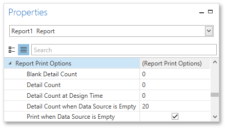

# Static Report
This tutorial describes the steps needed to create a _static report_, which means that the report is not bound to a data source. This example demonstrates how to create a report with the one-page content repeated 20 times.

To create a static report, do the following.
1. [Create a new report](../creating-reports/basic-operations/create-a-new-report.md).
2. Drop the [Rich Text](../report-elements/report-controls.md) control from the [Toolbox](../interface-elements/control-toolbox.md) onto the [Detail band](../report-elements/report-bands.md).
	
	
3. Right-click the created control and select **Load File...** in the invoked context menu.
	
	
4. In the invoked dialog, use the drop-down list to define the file's extension (**.rtf**, **.docx**, **.txt**, **.htm** or **.html**), select the file, and click **Open**.
5. Select the report, and in the [Properties Panel](../interface-elements/properties-panel.md), expand the **Report Print Options** property. Make sure that the **Print when Data Source is Empty** option is enabled, i.e., the report is allowed to be printed when it has no data source. To repeat the created report 20 times, set the **Detail Count when Data Source is Empty** property to **20**.
	
	
6. To print the report content on separate pages, set the band's **Page Break** property to **After the Band**.
	
	

The static report is now ready. Switch to the [Print Preview](../document-preview.md) tab and view the result.

