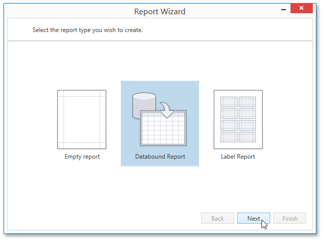

# Data-bound Report
The **Report Wizard** allows you to create three kinds of reports : [empty reports](empty-report.md), **data-bound reports** and [label reports](label-report.md). To create a data-bound report and generate its layout, select **Databound Report**.

Click **Next** to proceed to the next wizard page: [Select the Data Source Type](data-bound-report/select-the-data-source-type.md).

After completing the Data-bound Report Wizard, you get a tabular banded report. Depending on how many wizard steps you complete, you can apply data grouping, display totals, select one of the predefined style sheets, etc.