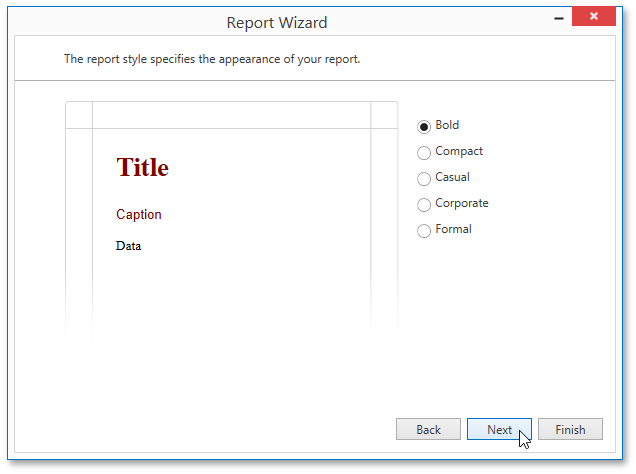

# Choose a Report Style
On this wizard page, you can specify one of the predefined visual styles for the report.

You can stop the wizard at this step by clicking **Finish**. If you want to customize your report further, click **Next** to proceed to the next wizard page: [Enter the Report Title](enter-the-report-title.md).