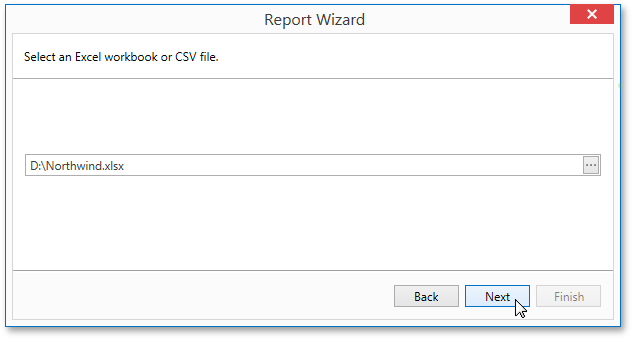

# Select an Excel Workbook or CSV file
On this wizard page, select a required Microsoft Excel workbook (the XLS, XLSX and XLSM formats are supported) or CSV file. To do this, click the ellipsis button and locate the source file, or enter the full path to this file.

Click **Next** to proceed to the next wizard page: [Specify Import Settings](specify-import-settings.md).