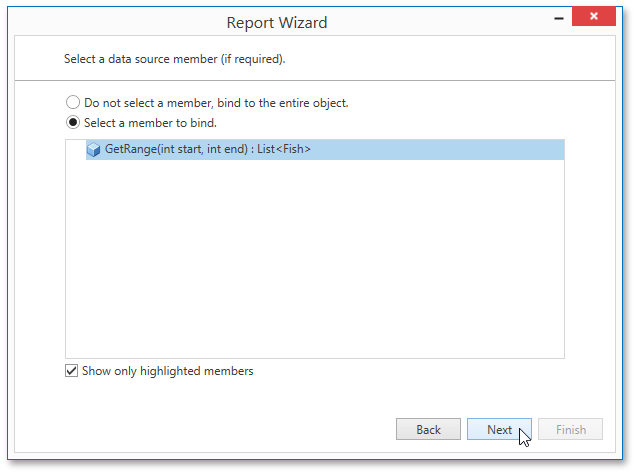

# Select a Data Source Member
This wizard page allows you to select whether you want bind to the entire object or to its public member (method or property).

Select the **Show only highlighted members** check box to exclude irrelevant members from the list. Otherwise, all available members will be shown.

Click **Next** to proceed to the next wizard page. If you select binding to the entire object, proceed to the [Select the Data Binding Mode](select-the-data-binding-mode.md) page. If you choose one of the available public members, go to the [Specify the Member Parameters](specify-the-member-parameters.md) page.