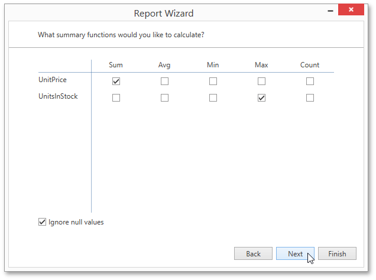
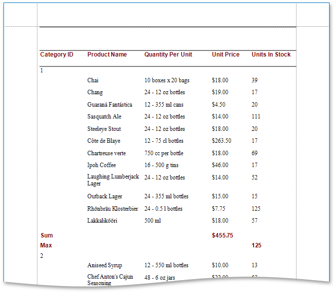

# Specify Summary Options
This wizard page allows you to specify totals for each data group or for the entire report. The specified totals will be displayed after corresponding groups and in the report footer.

The page displays all available numerical and date-time fields that are not used to group data. You can select desired functions using the check box table.

There are instances when data fields contain empty values. If you don't want to take these values into account when calculating totals, select the **Ignore NULL values** check box. Otherwise, these values will be treated as zeros for numeric fields and the earliest system date for date-time fields.

You can stop the wizard at this step by clicking **Finish**. If you do so, your report will look similar to the one in the image below.

If you want to further customize your report, click **Next** to proceed to the next wizard page: [Choose a Report Layout](choose-a-report-layout.md).