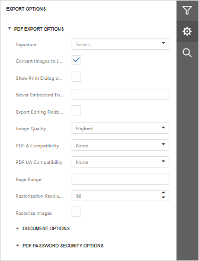
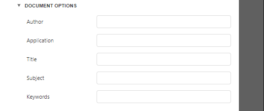
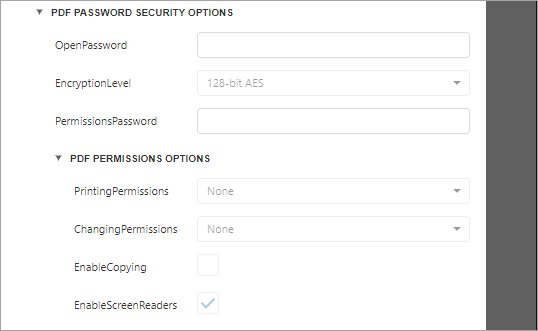

# PDF Export Options

Before [exporting a document](export-a-document.md) to PDF, you can specify PDF-specific options in the **Export Options** panel.

## General Options

* **Signatures**

	Provides access to digital signatures. Select a signature to sign the document on export to PDF.
* **Convert Images to Jpeg**
	
	Specifies whether all bitmaps contained in the document should be converted to JPEG format during export to PDF.
* **Show Print Dialog on Open**
	
	Specifies whether the **Print** dialog should be displayed when the resulting PDF file is opened in an appropriate application.
* **Never Embedded Fonts**
	
	Specifies font names which should not be embedded into the resulting file. To separate fonts, use semicolons.
* **Export Editing Fields To AcroForms**
	
	Specifies whether to convert a report's editing fields to interactive forms.

* **Image Quality**
	
	Specifies the document's image quality level. The higher the quality, the bigger the file, and vice versa.
* **PDF A Compatibility**
	
	Specifies document compatibility with the **PDF/A** specification.
* **Page Range**
	
	Specifies a range of pages which will be included in the resulting file. To separate page numbers, use commas. To set page ranges, use hyphens.
* **Rasterization Resolution**
	
	Specifies the image resolution for raster images.

## Document Options
The **Document Options** complex property contains options which specify the **Document Properties** of the created PDF file. Click the complex property's header to access its nested options.

## PDF Password Security Options
This complex property allows you to adjust the security options of the resulting PDF file.

* **Open Password**
	
	Specifies the password for opening the exported PDF document.
* **Encryption Level**
	
	Specifies the algorithm used to encrypt PDF content.
* **Permissions Password**
	
	Specifies the PDF permissions password for the document.
* **PDF Permissions Options**
	
	Provides access to the options which specify the permissions for printing, changing, copying, and accessing the exported document.