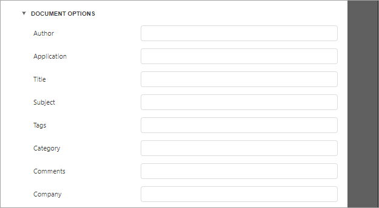

# XLS Export Options
Before [exporting a document](export-a-document.md) to XLS format, you can specify XLS-specific options in the **Export Options** panel.

* **Export Mode**
	
	Specifies how a document is exported to XLS.
* **Suppress 256 Columns Warning**
	
	Specifies whether to suppress the exception that raises when trying to export a document to an XLS file with more than 256 columns.
* **Suppress 65536 Rows Warning**
	
	Specifies whether to suppress the exception that raises when trying to export a document to an XLS file with more than 65536 rows.
* **Workbook Color Palette Compliance**
	
	Specifies the color palette compatibility mode with different workbook versions. The workbook palette can store no more than **56** colors. If you select the **ReducePaletteExactColors** value, original color values are kept, but only the first **56** colors are included in the palette. Choose **AdjustColorsToDefaultPalette** to degrade the color values to match the **56** standard colors of the default workbook palette.
* **Export Hyperlinks**
	
	Specifies whether hyperlinks should be exported to the XLS document.
* **Page Range**
	
	Specifies a range of pages which will be included in the resulting file. To separate page numbers, use commas. To set page ranges, use hyphens.
* **Raw Data Mode**
	
	Specifies whether to enable the raw data export mode. In this mode, only a document's actual data is exported to XLS, ignoring non-relevant elements, such as images, graphic content, font and appearance settings.
* **Sheet Name**
	
	Specifies the name of the sheet in the created XLS file.
* **Show Grid Lines**
	
	Specifies whether grid lines should be visible in the resulting XLS file.
* **Text Export Mode**
	
	Specifies whether value formatting should be converted to the native XLS format string (if it is possible), or embedded into cell values as plain text.
* **Rasterize Images**
	
	Specifies whether to rasterize vector images, such as pictures, charts, or barcodes.
* **Rasterization Resolution**
	
	Specifies the image resolution for raster images.
* **Fit To Printed Page Width**
	
	Shrinks the width of the exported document's printout to one page.
* **Fit To Printed Page Height**
	
	Shrinks the height of the exported document's printout to one page.
* **Ignore Errors**
	
	Specifies the document errors to be ignored in a resulting XLS file.
* **Right To Left Document**
	
	If you use right-to-left fonts in a report, enable the **Right-to-Left Document** option to use the right-to-left layout for sheets in the exported XLS file.

## Document Options
The **Document Options** complex property contains options which specify the **Document Properties** of the created XLS file. Click the complex property's header to access its nested options.

## Encryption Options
This complex property allows you to adjust the encryption options of the resulting XLS file.

* **Type**
	Specifies one of the following encryption types:
	* Strong (default) type uses the **Agile Encryption** mechanism.
	* Compatible type uses the **Standard Encryption** that is compatible with Excel 2007.
* **Password**
	Sets a password for the exported XLS file. XLS files support **ARC4** encryption (except for **RC4CryptoAPI**). Passwords for XLS files are stored as plain text in report definitions. Ensure that only trusted parties have access to report definition files.