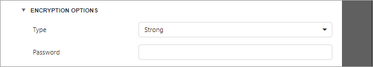

# XLSX-Specific Export Options
Before [exporting a document](export-a-document.md) to XLSX format, you can specify XLSX-specific options in the **Export Options** panel.

* **Export Mode**
	
	Specifies how a document is exported to XLSX. The following modes are available.
	* The **Single File** mode allows exporting a document to a single file, without dividing it into pages.
	* The **Single File PageByPage** mode allows exporting a document to a single file, while preserving the page-by-page breakdown. In this mode, the **Page Range** option is available.
* **Export Hyperlinks**
	
	Specifies whether to include hyperlinks into the resulting file.
* **Page Range**
	
	Specifies a range of pages which will be included in the resulting file. To separate page numbers, use commas. To set page ranges, use hyphens.
* **Raw Data Mode**
	
	Specifies whether to enable the raw data export mode. In this mode, only a document's actual data is exported to XLSX, ignoring non-relevant elements, such as images, graphic content, font and appearance settings.
* **Sheet Name**
	
	Specifies the name of the sheet in the created XLSX file.
* **Show Grid Lines**
	
	Specifies whether grid lines should be visible in the resulting XLSX file.
* **Text Export Mode**
	
	Specifies whether value formatting should be converted to the native XLSX format string (if it is possible), or embedded into cell values as plain text.
* **Rasterize Images**
	
	Specifies whether to rasterize vector images, such as pictures, charts, or barcodes.
* **Rasterization Resolution**
	
	Specifies the image resolution for raster images.
* **Fit To Printed Page Width**
	
	Shrinks the width of the exported document's printout to one page.
* **Fit To Printed Page Height**
	
	Shrinks the height of the exported document's printout to one page.
* **Ignore Errors**
	
	Specifies the document errors to be ignored in a resulting XLS file.
* **Right To Left Document**
	
	If you use right-to-left fonts in a report, enable the **Right-to-Left Document** option to use the right-to-left layout for sheets in the exported XLSX file.

## Document Options
The **Document Options** complex property contains options which specify the **Document Properties** of the created XLSX file. Click the complex property's header to access its nested options.

## Encryption Options
This complex property allows you to adjust the encryption options of the resulting XLSX file.

* **Type**
	Specifies one of the following encryption types:
	* Strong (default) type uses the **Agile Encryption** mechanism.
	* Compatible type uses the **Standard Encryption** that is compatible with Excel 2007.
* **Password**
	Sets a password for the exported XLSX file. Passwords for XLSX files are stored as plain text in report definitions. Ensure that only trusted parties have access to report definition files.

