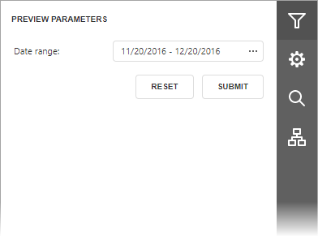

# Specify Parameter Values
A report may contain parameters that allows you to control the data displayed in the document.

  

 **Parameters**

To invoke the **Preview Parameters** panel, click the **Parameters** button on the Document Viewer side panel. This panel allows you to specify parameter values that apply when the document preview generation starts.

Use parameter editor to specify a parameter value and click **Submit**. After changing the current values, you can return to the original values by clicking **Reset**.

