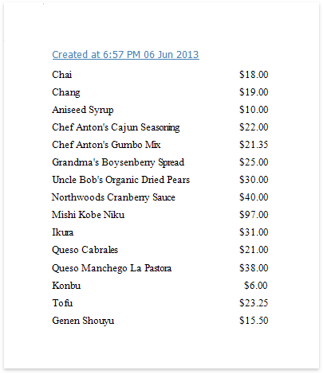
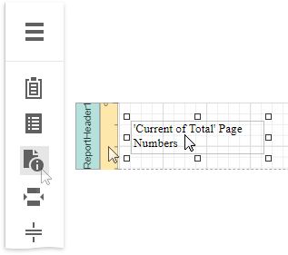
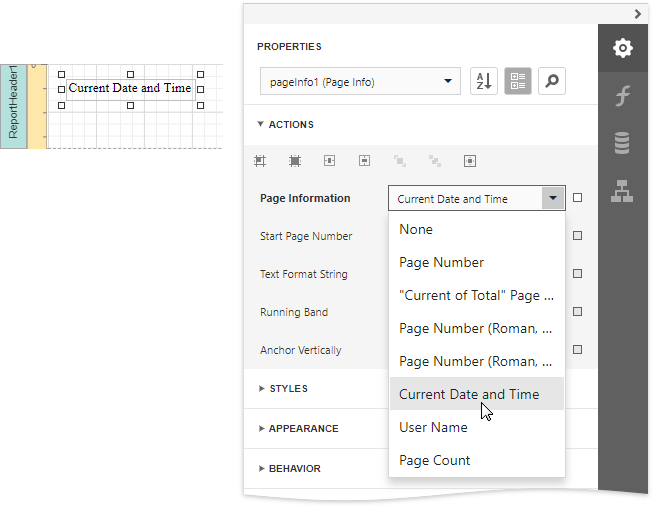
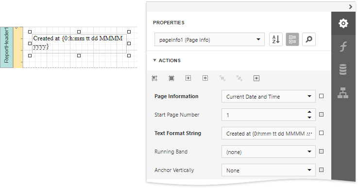

# Display the Current Date and Time in a Report

This tutorial demonstrates how to insert the current system date and time into a report using the [PageInfo](../use-report-elements/use-basic-report-controls/page-info.md) control.

Do the following to include information about the current date and time into a report:

1. The current date and time are usually displayed in the [Report Header](../introduction-to-banded-reports.md) band. To add it to the report,  click **Insert Report Header Band** in the context menu.
	
	
2. Drop the [PageInfo](../use-report-elements/use-basic-report-controls/page-info.md) control from the [Toolbox](../report-designer-tools/toolbox.md) onto the **Report Header** band.
	
	
3. Set the control's **Page Information** property to *Current Date and Time*.
	
	
4. To apply a format string to the control's contents, type **Created at {0:h:mm tt dd MMMM yyyy}** into its **Text Format String** property.
	
	