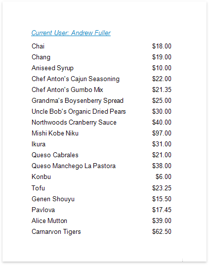
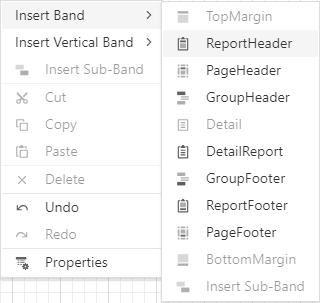
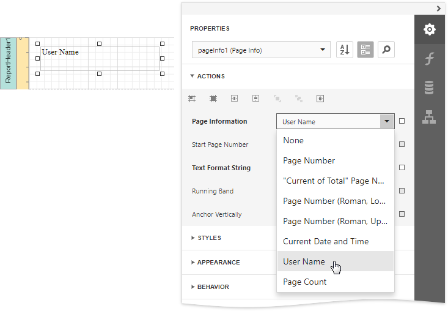

# Display the User Name in a Report

This tutorial demonstrates how to insert the current user name in a report using the [PageInfo](../use-report-elements/use-basic-report-controls/page-info.md) control.

Do the following to insert the user name into a report:

1. The user name is usually displayed in the [Report Header](../introduction-to-banded-reports.md) band. To add it to the report, click **Insert Report Header Band** in the context menu.
	
	

2. Drop the [PageInfo](../use-report-elements/use-basic-report-controls/page-info.md) control from the [Toolbox](../report-designer-tools/toolbox.md) onto the **Report Header** band.
	
	

3. Set the control's **Page Information** property to *User Name*.
	
	
4. Next, to apply a format string to the control's contents, type **Current User: {0}** into its **Text Format String** property.
	
	