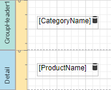
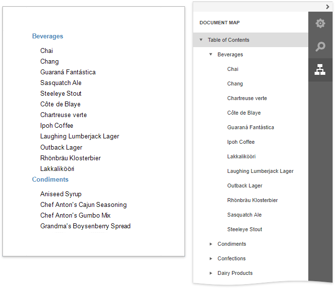
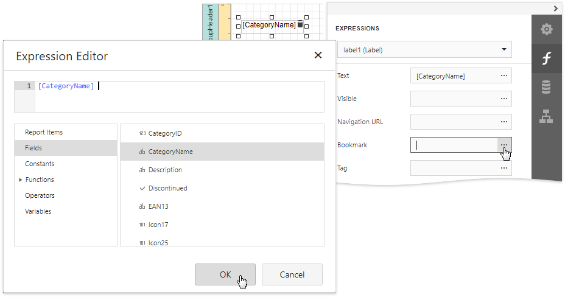
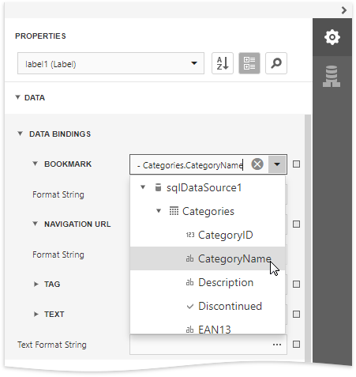
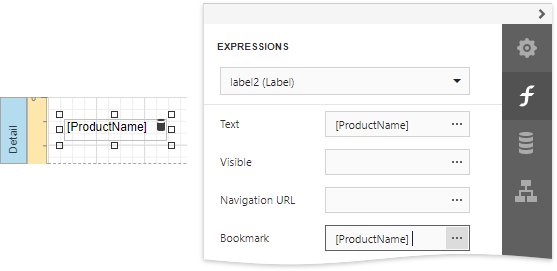
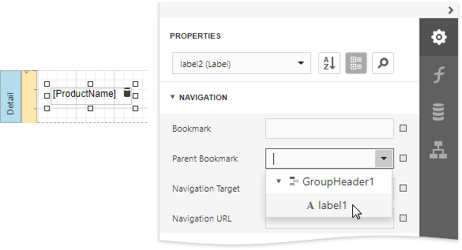
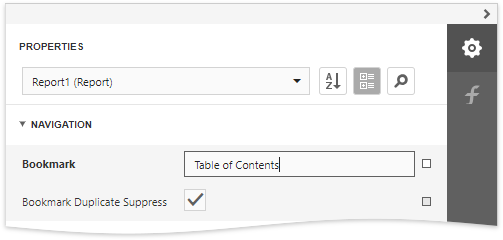

# Add Bookmarks and a Document Map

This document describes how to use bookmarks for mapping the report elements' hierarchy to the Document Map that is displayed in a [Print Preview](../preview-print-and-export-reports.md), and speeds up the navigation through complex reports.

The example below is based on the following report:

This report displays products that are [grouped](../shape-report-data/group-and-sort-data/group-data.md) by the **CategoryName** field. 

The following image illustrates the resulting report with a hierarchical Document Map. Clicking any bookmark navigates the Print Preview to the document section containing the associated element.

Use the following steps to generate a Document Map in your grouped report.

1. Select the label placed in the **Group Header** band and switch to the [Expressions](../report-designer-tools/ui-panels/expressions-panel.md) panel. Click the **Bookmark** property's ellipsis button, and in the invoked [Expression Editor](../report-designer-tools/expression-editor.md), select the **CategoryName** data field.
	
	
	
	In the legacy binding mode (if the Designer does not provide the **Expressions** panel), you can specify this property in the [Properties](../report-designer-tools/ui-panels/properties-panel.md) panel's **Data Bindings** category.
	
	
2. In the same way, select the label in the **Detail** band and bind its **Bookmark** property to the **ProductName** data field.
	
	
	
	Most of the reporting controls (for example, [Table](../use-report-elements/use-tables.md), TableCell, [CheckBox](../use-report-elements/use-basic-report-controls/check-box.md), etc.) supports the **Bookmark** property.
3. Set the same label's **Parent Bookmark** property to the label in the group band. This arranges bookmarks into a parent-child structure reflecting the report elements' hierarchy in the Document Map.
	
	
	
	> [!NOTE]
	> Avoid cyclic bookmarks that occur when you assign two bookmarks as parents to each other. In this scenario, an exception raises when you attempt to create the report document.
4. Select the report itself and assign text to its **Bookmark** property to determine the root node's caption in the **Document Map**.
	
	
	
	The root bookmark displays the report name if you do not specify this property.

> [!NOTE]
> Duplicated bookmarks are suppressed to prevent adding multiple bookmarks with the same name to a final document. You can disable the  report's **Bookmark Duplicate Suppress** property to allow duplicated bookmarks.