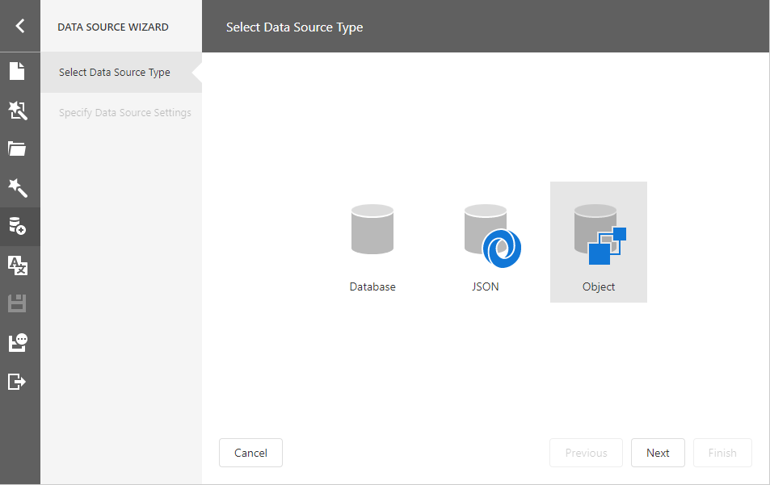
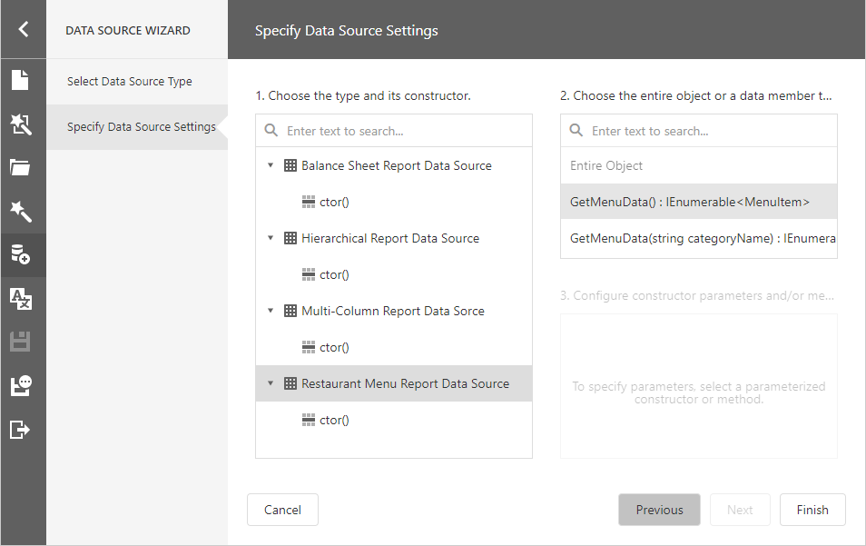
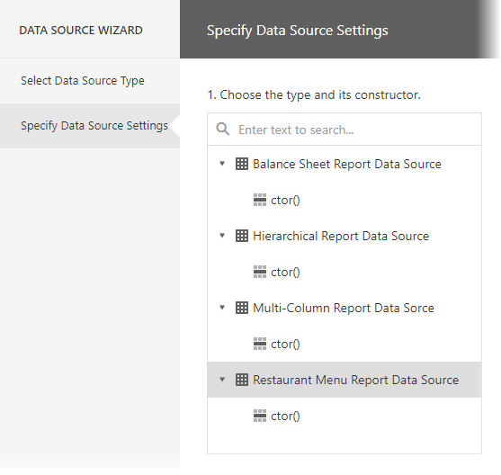
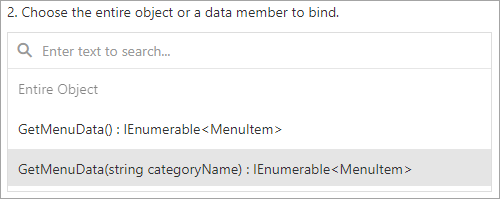
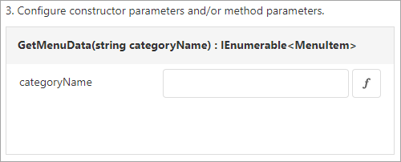
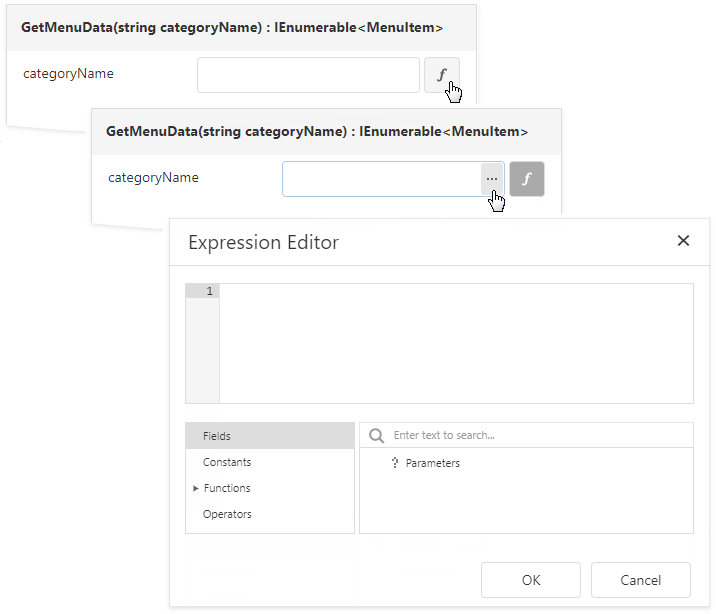
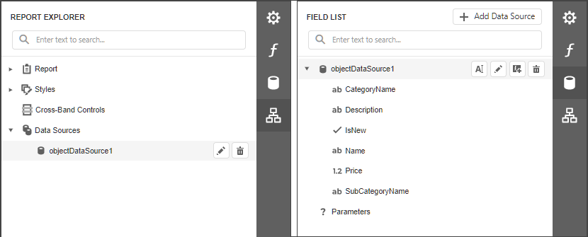
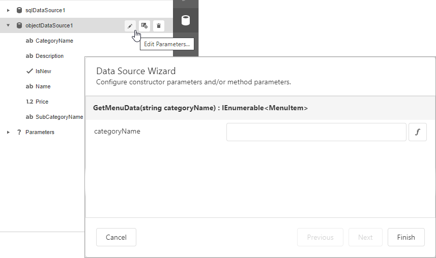

# Bind a Report to an Object Data Source

This topic describes how to bind a report to object data at design time.

## Add a New Data Source

1. Select **Add Data Source** from the [designer menu](../report-designer-tools/menu.md).
	
    

    This invokes the [Data Source Wizard](../report-designer-tools/data-source-wizard.md).

2. Choose **Object** and click **Next**.
	
    

3. Specify data source settings on the next screen.

    

    * Select a data object or constructor from the list. If you select a data object, its default constructor is used.

        

    * Select the method that should provide data or select **Entire Object** to bind the report to the object's fields.

        

    * Specify constructor and/or data member parameters, if required.

        

        You can use expressions to provide data source parameter values. Click the  button to switch the parameter's editor to the expression mode. Specify an expression in the parameter's editor, or click the parameter's ellipsis button to launch the [Expression Editor](../report-designer-tools/expression-editor.md). You can use [report parameters](../use-report-parameters.md) in expressions to specify an input value for a data source parameter.

        

Click **Finish** to close the Data Source Wizard.

Once you finished the wizard, the data source becomes available in the [Report Explorer](../report-designer-tools/ui-panels/report-explorer.md)'s **Data Sources** node. The [Field List](../report-designer-tools/ui-panels/field-list.md) reflects the data source structure.

## Configure Parameters

Choose an **ObjectDataSource** component in the Field List and click **Edit Parameters**. Reconfigure the parameters on the invoked wizard page and click **Finish** to apply the changes.

For more information on how to set up an object data source, refer to the [Data Source Wizard](../report-designer-tools/data-source-wizard.md).