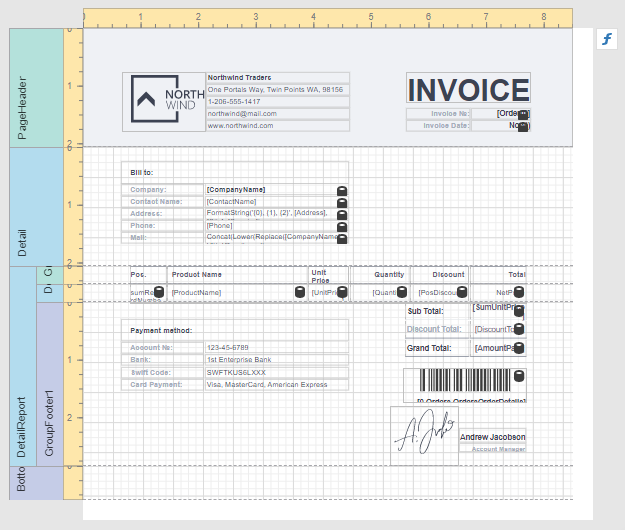
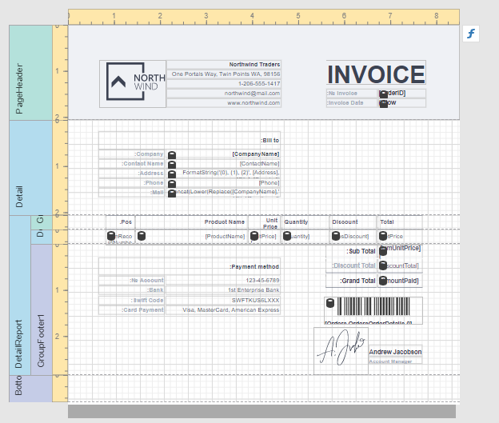

# Enable the Right-To-Left Layout

The report and most of the report controls provide the **Right to Left** and **Right to Left Layout** property. 

## Right to Left

The  property specifies content layout within a control (for most controls, this property affects the direction of their text, and for the [Check Box](../use-report-elements/use-basic-report-controls/check-box.md), this property also affects the check box position within the control).

* **Disabled**

    

* **Enabled**

    

Initially all report controls have this property set to **Inherit**, and when you enable it for a report, the setting is enabled for all report controls.

The following controls support this feature:

* [Label](../use-report-elements/use-basic-report-controls/label.md)
* [Check Box](../use-report-elements/use-basic-report-controls/check-box.md)
* [Page Info](../use-report-elements/use-basic-report-controls/page-info.md)
* [Panel](../use-report-elements/use-basic-report-controls/panel.md)
* [Cross Tab](../create-reports/cross-tab-reports.md)
* Pivot Grid (deprecated)
* [Table](../use-report-elements/use-tables.md)
* [Table of Contents](../use-report-elements/use-basic-report-controls/table-of-contents.md)

For the **Panel** and **Table** controls, this option affects contained controls.

## Right to Left Layout

When the **Right To Left** property of a report is set to **Yes**, you can also enable the **Right To Left Layout** property that specifies the position of controls within [report bands](../introduction-to-banded-reports.md). Enabling the right-to-left layout will also swap the page margins of a document (you are not allowed to place controls outside the right page margin).

The coordinates of report controls remain unchanged, only the point and direction of reference change (the X coordinate is calculated based on the top right corner).

The right-to-left layout is preserved when exporting a report to any [supported format](../preview-print-and-export-reports.md).        