# Create Reports

This section contains tutorials that explain how to create different reports.

## Basic Reports

### [Table Reports](create-reports/table-reports.md)
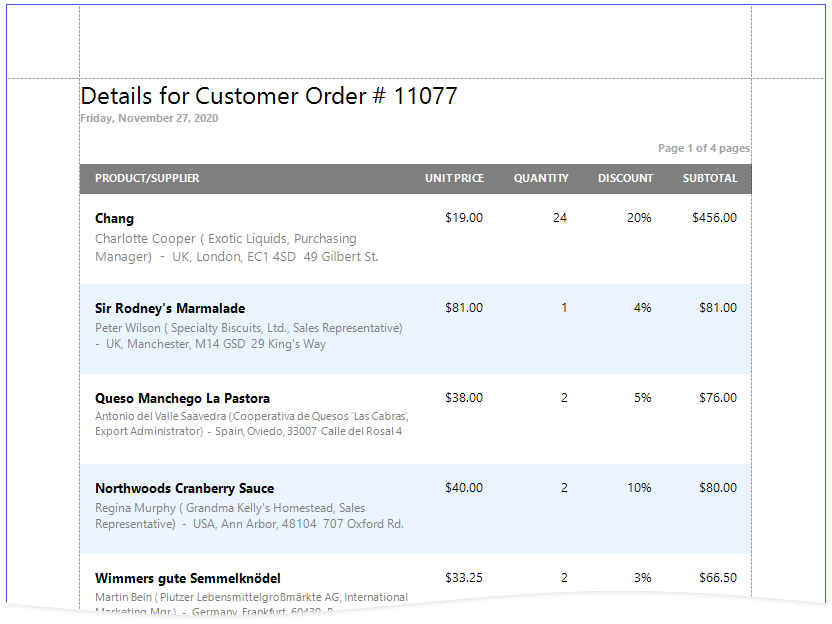

### [Vertical Reports](create-reports/vertical-reports.md)

### [Letters](create-reports/letters.md)
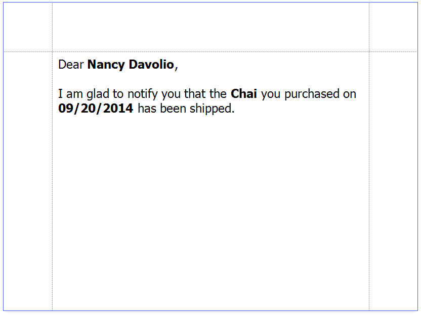

## Reports with Hierarchical Data

### [Master-Detail Reports with Detail Report Bands](create-reports/master-detail-reports-with-detail-report-bands.md)
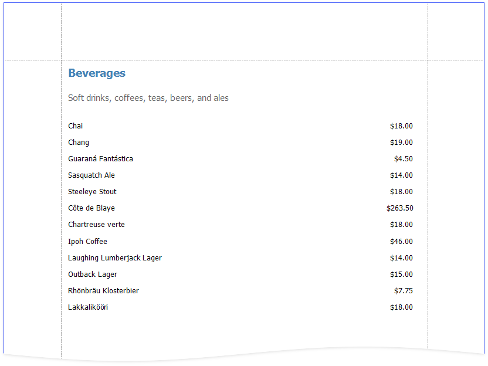

### [Master-Detail Reports with Subreports](create-reports/master-detail-reports-with-subreports.md)
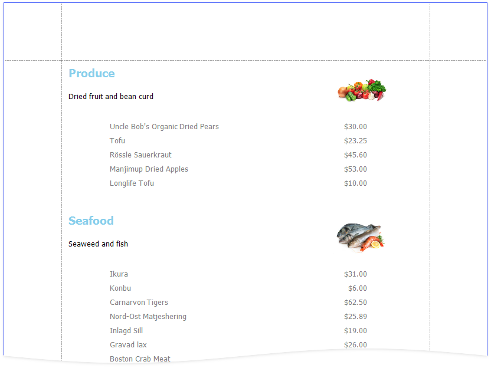

### [Hierarchical Reports](create-reports/hierarchical-reports.md)
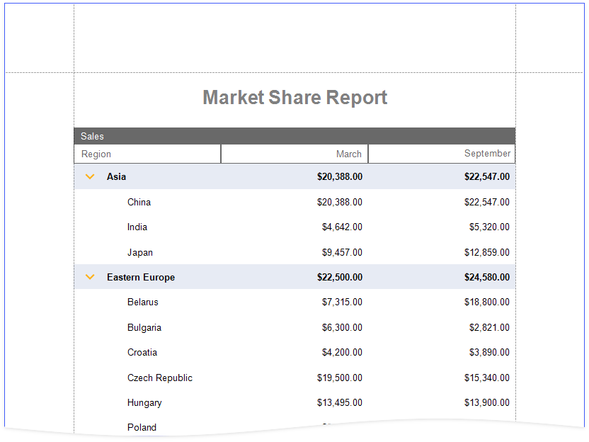

## Invoice Reports

### [Invoices](create-reports/invoices.md)

## Cross-Tab Reports

### [Cross-Tab Reports](create-reports/cross-tab-reports.md)

## Multi-Column Reports

### [Labels and Badges](create-reports/labels-and-badges.md)
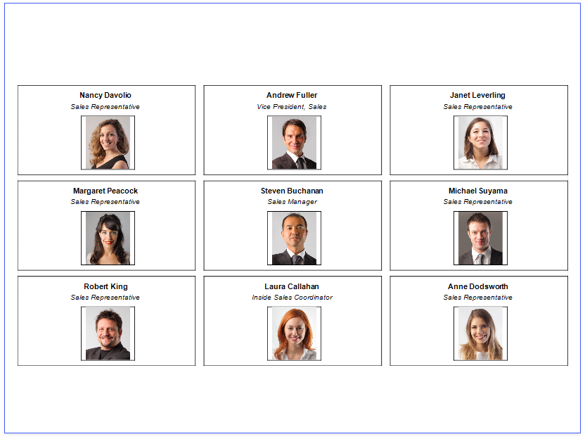

### [Multi-Column Reports](create-reports/multi-column-reports.md)
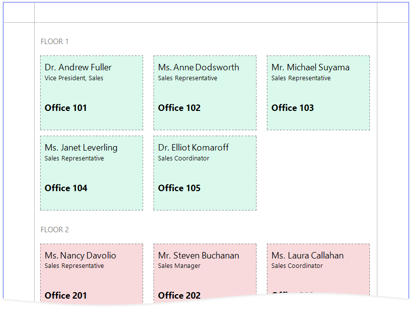

## Interactive Reports

You can add interactive elements to your report to customize it in Print Preview:

### [Interactive E-Forms](create-reports/interactive-e-forms.md)
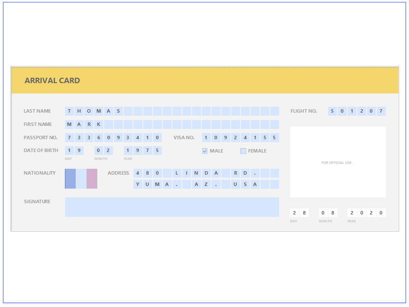

> [!Note]
> See the [Provide Interactivity](provide-interactivity.md) section for information on how to provide drill-down and drill-through functionality in your reports.
> 
> See [Use Report Parameters](use-report-parameters.md) for instructions on how to submit parameter values in Print Preview to customize your reports.

## Layout Features

### [Reports with Cross-Band Content and Populated Empty Space](create-reports/reports-with-cross-band-content-and-populated-empty-space.md)
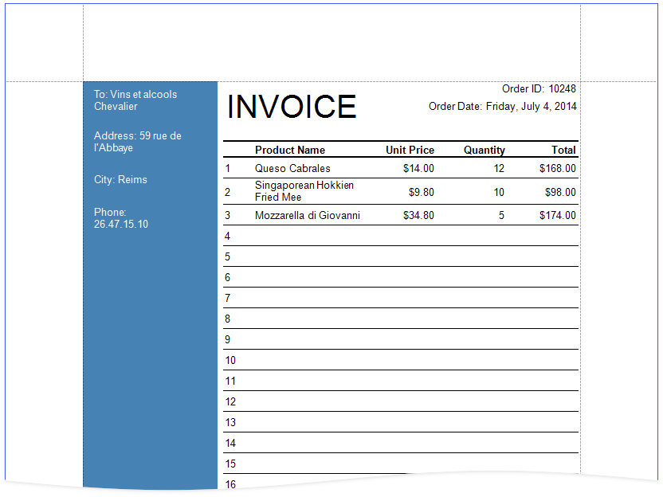

### [Reports with PDF content](create-reports/reports-merged-with-pdf.md)
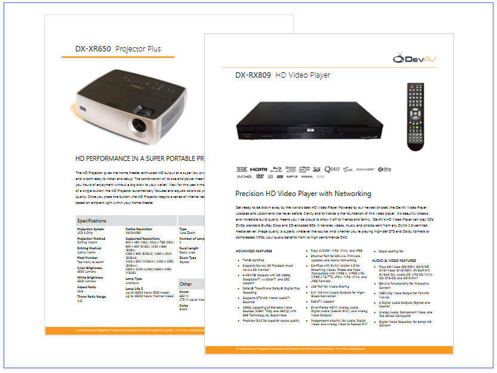

### [Reports with a Visual PDF Signature](create-reports/reports-with-visual-pdf-signature.md)
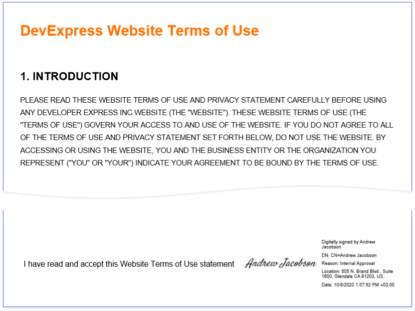

