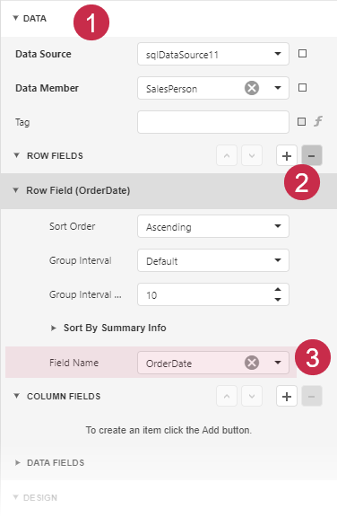
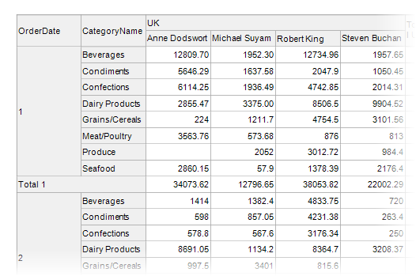
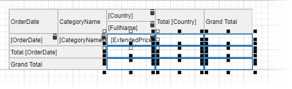

# Cross-Tab Reports

A cross-tab report displays complex multi-dimensional data, such as summary statistics, surveys, and market research information. This report uses a Cross Tab control that calculates automatic summaries and grand totals across grouped rows and columns.

## Add a Cross Tab Control and Bind to Data

1. [Create a new report](../add-new-reports.md) or [open an existing one](../open-reports.md).

2. Drop the **Cross Tab** control from the [Toolbox](../report-designer-tools/toolbox.md) onto the [Detail band](../introduction-to-banded-reports.md).

    

    You cannot place a Cross Tab in another report control ([Table Cell](../use-report-elements/use-tables.md) or [Panel](../use-report-elements/use-basic-report-controls/panel.md)).

3. Invoke the designer [menu](../report-designer-tools/menu.md) and click **Add Data Source...**.

   
   
   Navigate through the invoked [Data Source Wizard](../report-designer-tools/data-source-wizard.md)'s pages to set up the data source. See the [Bind to Data](../bind-to-data.md) section for more information. 

4. Select the entire Cross Tab control. For this, click the designer surface outside the control and drag the mouse to the control until the entire control is selected. 

    

5. Bind the Cross Tab control to the data source. In the [Properties Panel](../report-designer-tools/ui-panels/properties-panel.md) expand the **CROSS TAB TASKS** section and specify the **Data Source** and **Data Member** properties.

    

    > [!NOTE]
    > Ensure that a report's **Data Source** property is not set if you place the Cross Tab in the Detail band. Otherwise, the Cross Tab data is printed as many times as there are rows in the report data source.

## Define Cross Tab Fields

1. In the **Properties Panel**, expand the **DATA** section and click **plus** in the **ROW FIELDS** section to add a Row Field. Select the field name from the drop-down list:

    

    You can repeat these steps to add another row field.

2. In the **Properties Panel**, expand the **DATA** section and click **plus** in the **COLUMN FIELDS** section to add a Column Field. Select the field from the drop-down list:

    

    You can repeat these steps to add another column field.

3. In the **Properties Panel**, expand the **DATA** section and click **plus** in the **DATA FIELDS** section to add a Data Field. Select the field from the drop-down list:

    

The resulting cross-tab control looks as follows:

## Specify Group Settings

Select the Cross Tab cell bound to the `OrderDate` field and click its smart tag. Set the **GroupInterval** property to `DateQuarter` to group data by quarters.

Switch to the **Report Viewer** to preview the result:

## Format Data

1. Format the currency data. Hold down CTRL, and select the following cells:

    - the cell bound to the `ExtendedPrice` field
    - the cells that display column and row totals
    - the cells that display column and row grand totals

    

    Switch to the Properties window and set the `TextFormatString` property to **{0:c}**.

    

2. Select the cell bound to the `OrderDate` field:

   

   Set the **Text Format String** option to `Quarter {0}`.

   

Switch to the Report Viewer to observe the result:

## Customize Appearance

1. Select the entire Cross Tab control, switch to the Properties window, and expand the **STYLES** section. Expand the **GENERAL STYLE** section and set the Border Color to 160, 160, 160. This value applies to all Cross Tab cells.

    

2. Expand sections for the **HEADER AREA**, **DATA AREA** and **TOTAL AREA** styles and adjust the appearance as your needs dictate.

## Adjust the Content Size

Select the column bound to the **FullName** field and set the `ColumnAutoWidthMode` property to **ShrinkAndGrow**. The column width varies depending on the content.

## Adjust the Report Layout

Specify the **Landscape** page orientation and set the **Vertical Content Splitting** option to `Smart` to prevent content from being split across pages.

## Observe the Result

Switch to the **Report Viewer**. The resulting report is shown below:

