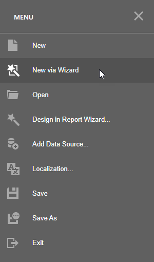
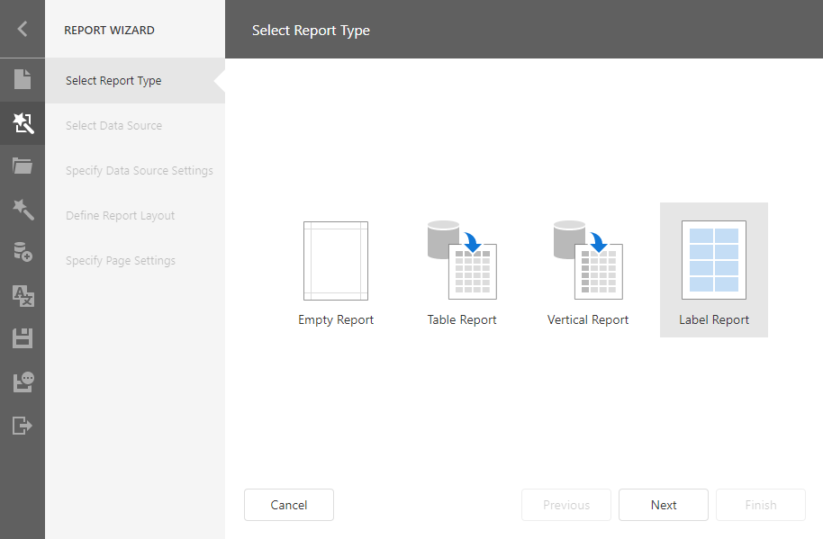
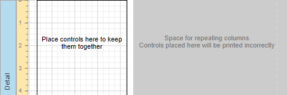
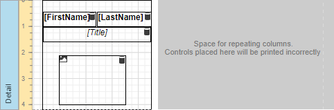

# Labels and Badges

This tutorial describes the steps to create a label report that contains employee badges.

1. [Create a new report](../add-new-reports.md) and [bind it](../bind-to-data.md) to a required data source (for instance, to a table that contains information about employees).

2. Open the designer [menu](../report-designer-tools/menu.md) and click **New via Wizard**.

    

3. The wizard guides you through the process of creating a label report. Refer to [Label Report](../report-designer-tools/report-wizard/label-report.md) for detailed instructions on the wizard's steps. 

    

4. After performing the above steps you will see that the report's Detail band is now divided into three differently colored areas. The first area at the left-hand side indicates the actual available band area for controls to be placed within it. The gray area at the right-hand side is intended for the columns in which labels will be displayed, so it cannot be occupied by controls. Finally, the white area specifies an indent between the available and reserved areas.

    

5. Drop the required fields from the [Field List](../report-designer-tools/ui-panels/field-list.md) onto the available Detail band's area and adjust the layout.

    

    If required, you can apply [mail merge](../use-report-elements/use-embedded-fields-mail-merge.md) to combine several fields within the same [Label](../use-report-elements/use-basic-report-controls/label.md) control.

    For the [Picture Box](../use-report-elements/use-basic-report-controls/picture-box.md) control, you can set its **Sizing** property to **Zoom Image**.

Switch to [Print Preview](../preview-print-and-export-reports.md) to see the resulting report.

