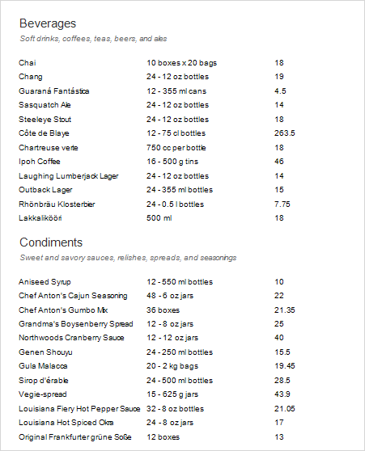
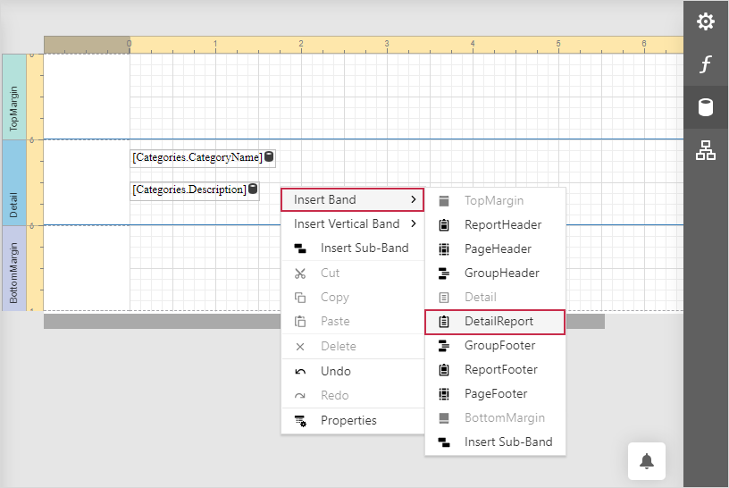
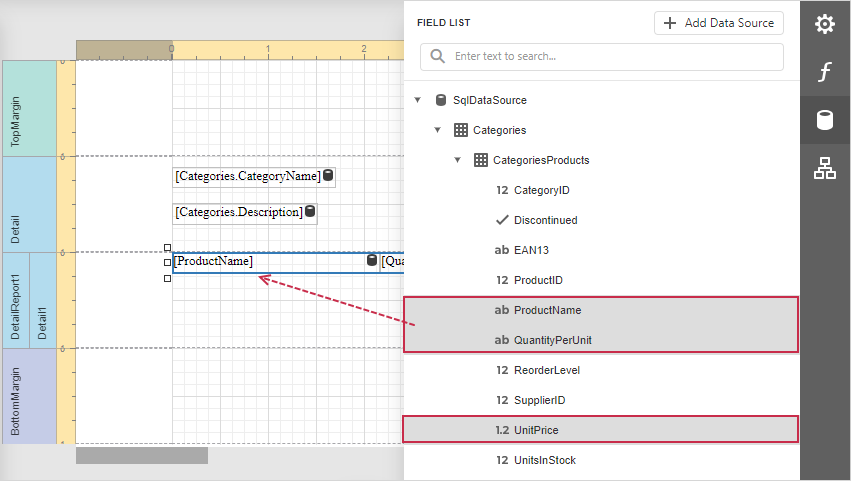

# Master-Detail Report with Detail Report Bands

This tutorial illustrates how to display hierarchical data in a master-detail report using nested [Detail Report bands](../introduction-to-banded-reports.md). This technique is effective if your data source contains a master-detail relationship. Another technique is described in the following topic: [Master-Detail Reports with Subreports)](master-detail-reports-with-subreports.md).

1. [Create a new report](../add-new-reports.md) or [open an existing one](../open-reports.md).

2. [Bind the report](../bind-to-data.md) to the required data source and set up a master-detail relationship as described in the [Bind a Report to a Database](../bind-to-data/bind-a-report-to-a-database.md) topic.

3. Drop the required data fields from the [Field List](../report-designer-tools/ui-panels/field-list.md) onto the [Detail](../introduction-to-banded-reports.md) band.

    

4. Click **Insert Detail Report Band** to create a [Detail Report Band](../introduction-to-banded-reports.md).

    

    Select the Detail Report band and select the master-detail relationship's name in the **Data Member** property's drop-down list.

    

5. Switch to the **Field List**, select the data fields while holding down CTRL or SHIFT and drag-and-drop them onto the Detail band.

    

    > [!NOTE]
    > You should drag-and-drop fields from the category corresponding to the master-detail relationship to correctly generate the detail report's data. Otherwise, the report will display only the first record of the detail table as many times as there are records in this table.

6. Customize the report's [appearance](../customize-appearance.md) and [format values](../shape-report-data/format-data.md).

Switch to [Preview](../preview-print-and-export-reports.md) to see the resulting report.