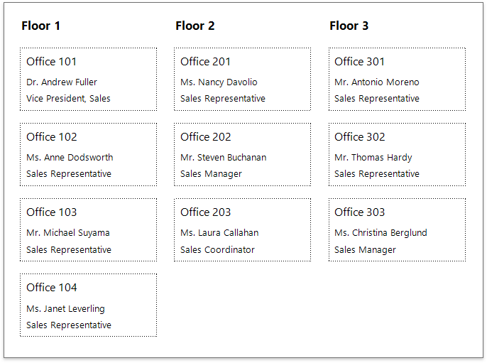
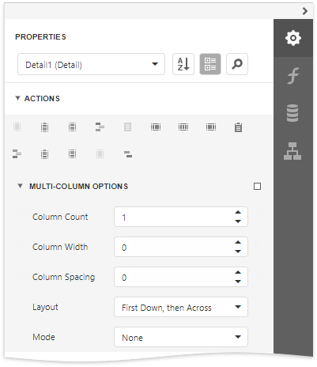
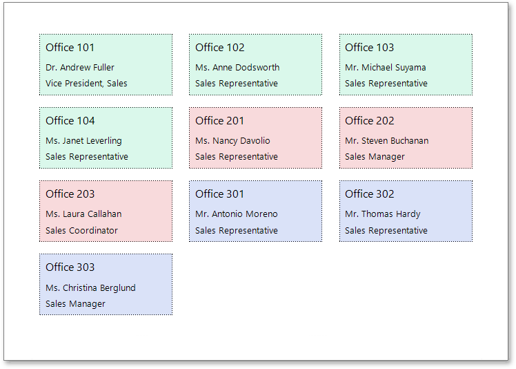
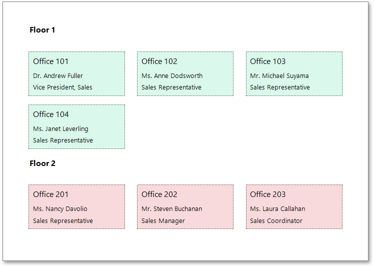
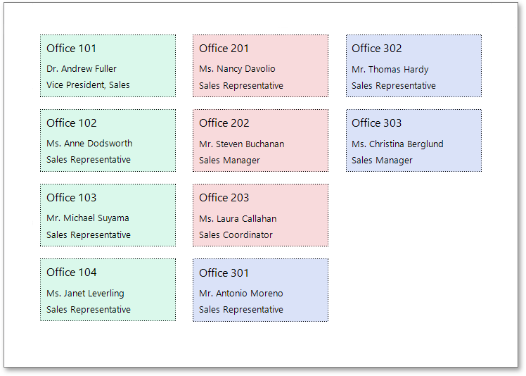
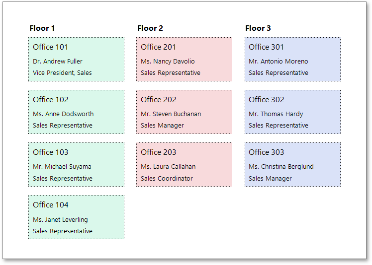
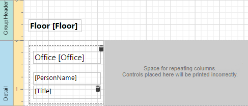
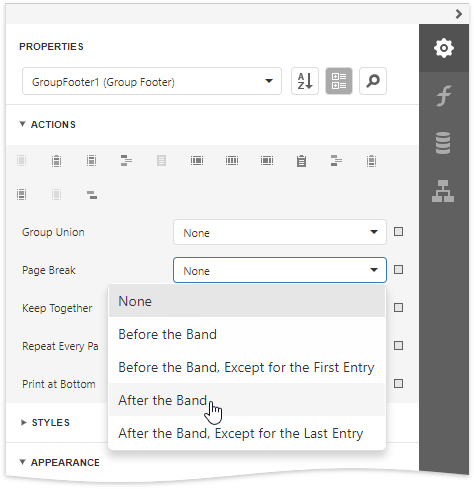

# Multi-Column Reports

This document describes how to arrange report data in multiple columns, which can be used to create mailing labels, business cards or multi-column directories.

## Settings
To access the multi-column settings of a report's Detail band, switch to the [Properties](../report-designer-tools/ui-panels/properties-panel.md) panel and expand the **Detail Tasks** or the **Behavior** category.

**Mode**

Enables you to select one of the following modes:

* **None** 

    Disables the multi-column layout.

* **Use Column Count**

    Makes the report display a specific number of columns based on the **Column Count** value. When this property is set to **1**, the report looks as though its multi-column layout is disabled.

* **Use Column Width** 

    Makes the report columns have a specific width based on the **Column Width** value. With this setting, the report displays as many columns as it is possible according to the specified column width, column spacing and report page size.

**Column Spacing**

Specifies the distance between adjacent columns. This value is measured in [report units](../configure-design-settings/change-a-report-measurement-units.md).

**Layout** 

Specifies the preferred direction for arranging report data within columns.

* **First Across, then Down**

    The report data is arranged horizontally and is wrapped to the next row on reaching the right page margin.

    

    When the report data is grouped, the multi-column layout is applied to each group individually.

    

* **First Down, then Across**

    The report data is arranged vertically and is wrapped to the next column on reaching the bottom page margin.

    

    When the report data is grouped, you can make each group start on a new column by setting the **Page Break** property of the Group Footer to **After the Band**.

    

## How It Works
The following image illustrates a report designer with a multi-column layout applied to the report:

In multi-column mode, the report's design surface is limited to the area defined by the column width. This is the only area intended to contain report controls.

The rest of this surface defines the space on a page remaining for printing columns and column spacing area.

In the above image, the report data in the Detail band is contained within a [Panel](../use-report-elements/use-basic-report-controls/panel.md) that provides borders around the enclosed content.

You can also specify a custom background color for the Panel. To learn how to change this color dynamically (based on the report's underlying data), see [Conditionally Change a Control's Appearance](../shape-report-data/specify-conditions-for-report-elements/conditionally-change-a-control-appearance.md).

When the report data is [grouped](../shape-report-data/group-and-sort-data/group-data.md) (as in the above image), and the **First Down, then Across** multi-column layout is used, you can make each group start on a new column. To do this, set the **Page Break** property of the Group Footer to **After the Band** or **After the Band, Except for the Last Entry**. When there is no data to display in the Group Footer, set the band height to zero.

