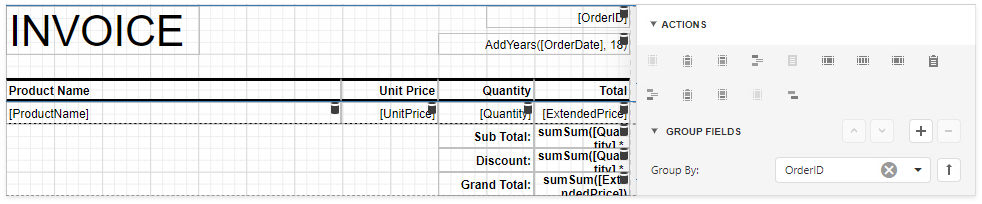
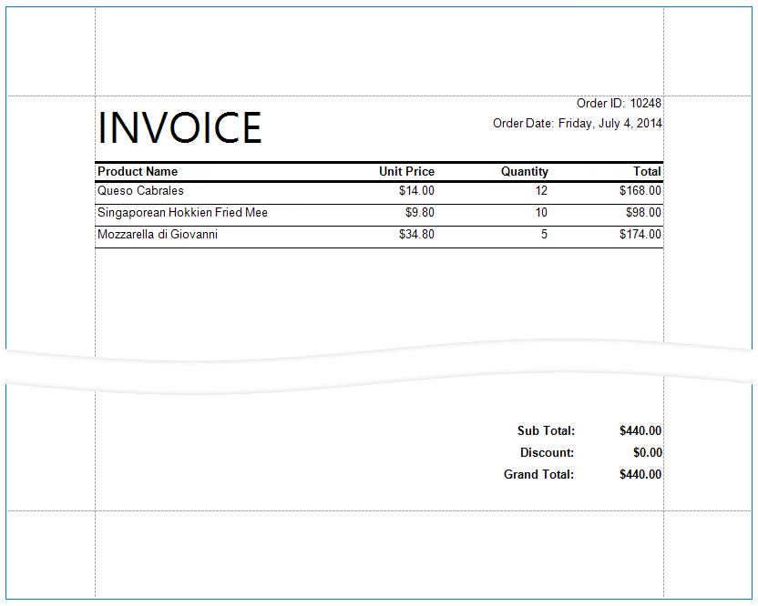
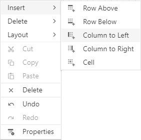
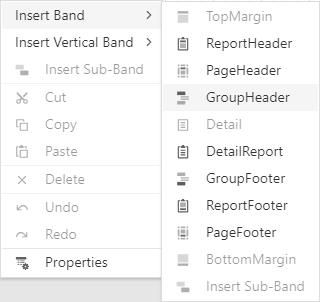
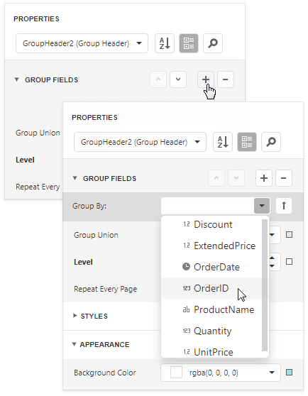
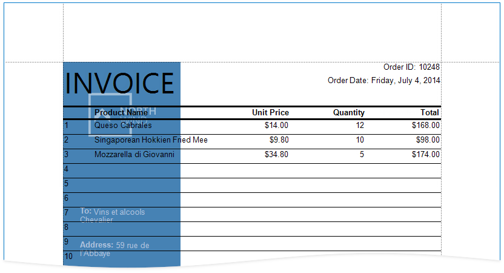

# Reports with Cross-Band Content and Populated Empty Space

This document describes how to create a report with the following layout options:

- Print part of the content across bands (the blue panel);
- Populate the empty space between the detail and footer information with blank rows.

## Initial Report

In this tutorial, the report [groups data](../shape-report-data/group-and-sort-data.md) by a data source field (the report's group field).

The _GroupFooter_ band is displayed at the bottom of the page (the **Print At Bottom** property is enabled). There is an empty space between the **Detail** band's data and the footer.

## Add Line Numbers

1. Select the first cell in the [Detail band](../introduction-to-banded-reports.md)'s table and click **Insert Column to the Left** from the cell's context menu.

	

2. Select the new cell and set **Summary**/**Running** to _Group_.

	

3. Switch to the **Expressions** tab and click the **Text** property's ellipsis button. Specify the _sumRecordNumber()_ expression in the invoked Expression Editor.

	

	Each row now includes a number.

## Populate the Empty Space

Populate the empty space between the _Detail_ band's data and the footer.

Select the _Detail_ band and enable the **Fill Empty Space** property.

The empty space is now populated with numbered lines.

> [!NOTE]
> Set the **Text** properties of the _Detail_ band's controls to display static text within the added lines.

## Add Cross-Band Data

Add a panel with recipient details across the entire group. Place the panel on a separate _Group Header_ band that is printed on the background of other bands.

1. Select the report and select **Insert Group Header** from the report's context menu

	

	> [!Tip]
	> Choose a _Page Header_ band instead of the _Group Header_ to display the cross-band content on an entire page.

2. Select the added band and enable the **Print Across Bands** property. This displays the band content on the background of the _GroupHeader1_, _Detail_, and _GroupFooter1_ bands.

	

3. The report's group field is in the _GroupHeader1_ band's **Group Fields** collection. The new band is above **GroupHeader1** and does not participate in the report's group. Move the group field to the new band.

	* Select _GroupHeader1_ and remove the group field from **Group Fields**.

	

	* Select the new band and add the group field to **Group Fields**.

	

4. Add a [Panel](../use-report-elements/use-basic-report-controls/panel.md) control to the _Group Header_. Specify the panel's **Background Color** and drop fields onto the panel.

	

5. Adjust the panel's width and height. The height should match the page height, as the footer is printed at the bottom of the page (the _Group Footer_'s **Print At Bottom** property is enabled).

	

6. Switch to Print Preview. The panel is printed on the background of the group content.

	

1. Resize the content in other bands to print it side-by-side with the panel.

	

See the final report in Print Preview.

