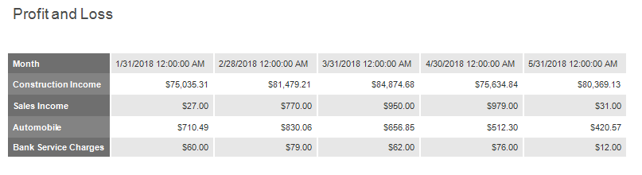
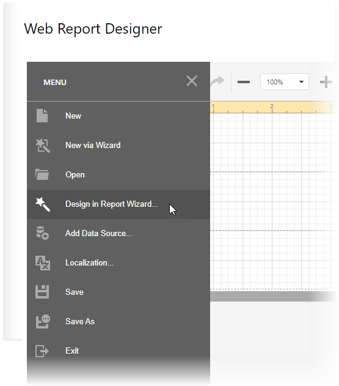
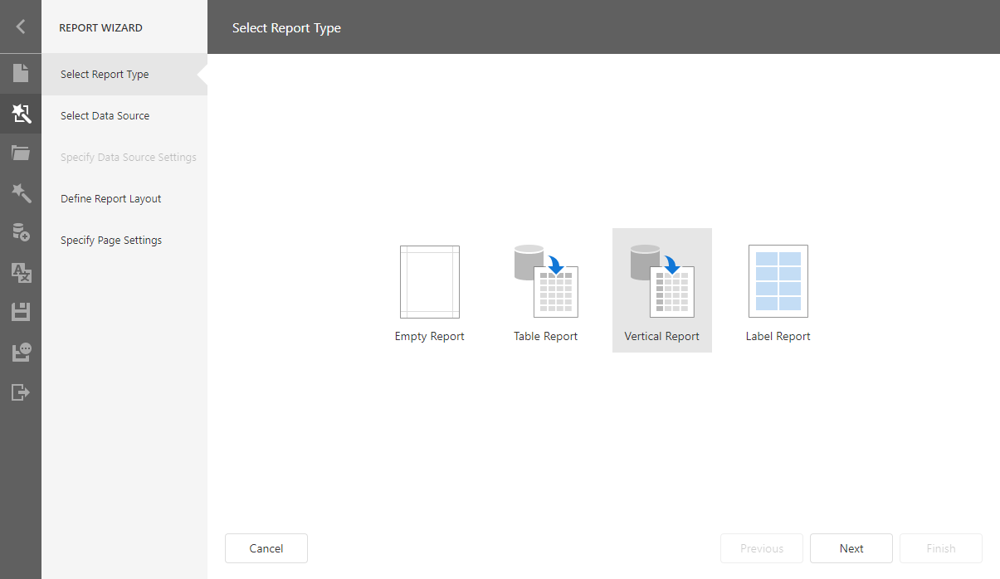
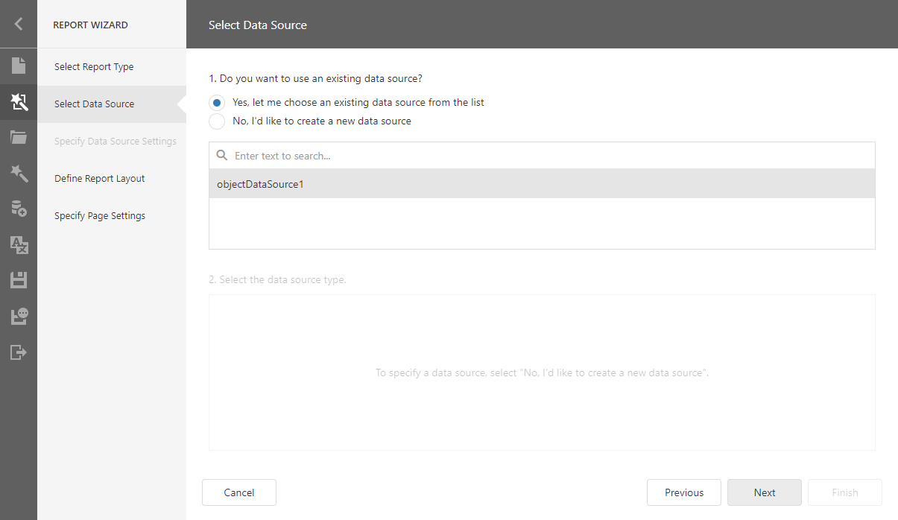
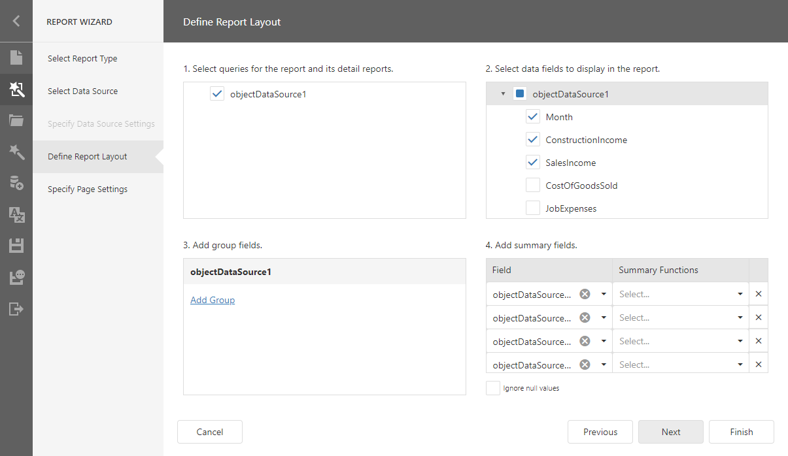
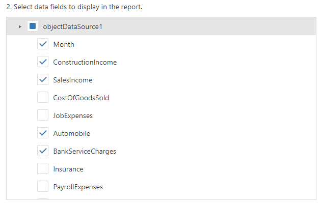
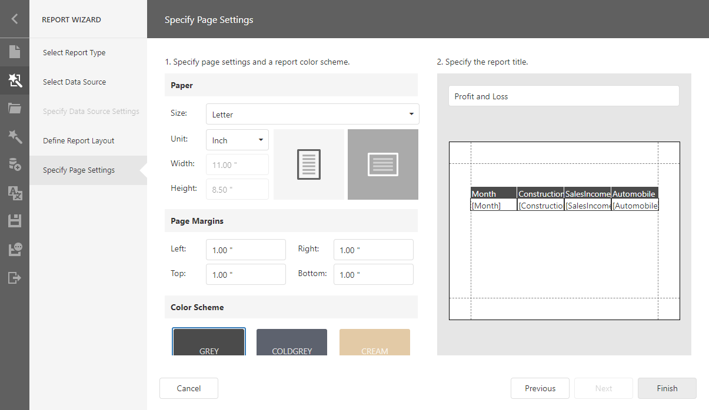
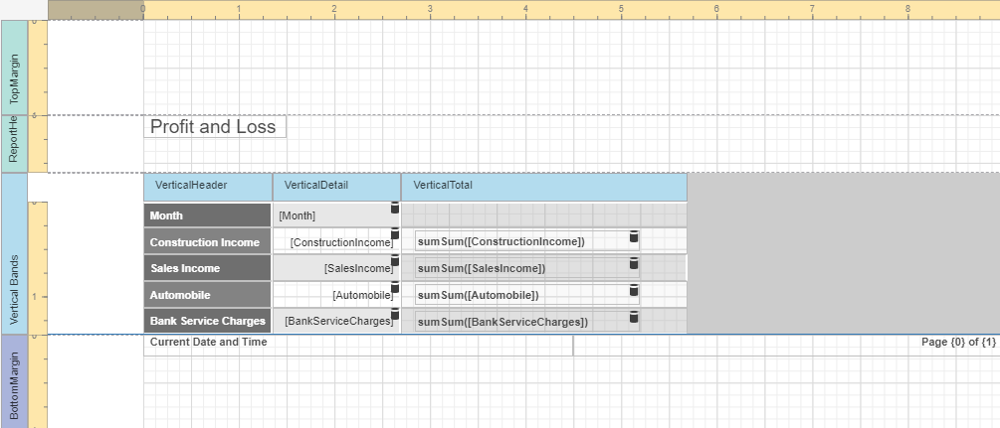
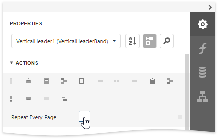
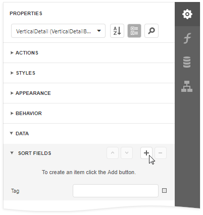

# Vertical Reports

This tutorial describes how to use vertical bands to create a report where record fields are arranged vertically and data records are printed horizontally.

# Design a Report in Report Wizard

1. [Create a new report](../add-new-reports.md) or [open an existing one](../open-reports.md).

1. Open the Web Report Designer's menu. Select **Design in Report Wizard**.

    

1. In the invoked Report Wizard, select **Vertical Report** and click **Next**.

    

1. Select a data source for the report.

    

1. Select queries and data fields to include in the report. Add summary fields.

    

    - Select data fields:
        
    - Add summary fields:
        

1. Specify page settings (Landscape orientation) and set the title (Profit and Loss).

    

1. Click **Finish** to open the generated report in the Report Designer.

    

The wizard adds report controls to the following [bands](../../report-designer/introduction-to-banded-reports.md):

- **Vertical Header band**  
    Contains a table with a single column that displays data field headers.
- **Vertical Details band**  
    Contains a table with a single column that is printed as many times as there are records in the report's data source.
- **Vertical Total band**  
    Contains a table with a single column that has as many labels in cells as there are summary functions you specified for each field in the Report Wizard.

Switch to the Preview mode to see the result.

> [!Tip]
> You can create a vertical report without using the Report Wizard. Click **Insert Vertical Header Band** from the report's context menu.
>
> Refer to the [Introduction to Banded Reports](../../report-designer/introduction-to-banded-reports.md#vertical-bands) topic for more information.

## Set Vertical Table Options

You can set the following options to modify the vertical table:

* Set the Vertical Header band's **Repeat Every Page** property to false to display field headers once - on the first report page.

    

* Set the Vertical Detail band's **Band Layout** property to **Across Then Down** to print the data records that do not fit a page on the same page, otherwise, they are printed on the next page.

    

* Add a field to the **Sort Fields** group to sort the report's data.

    