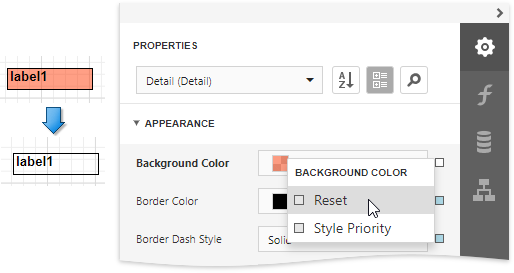

# Appearance Properties

This document describes the purpose and implementation of the appearance properties - a special set of properties that allow you to customize the appearance of a report or any of its elements.

## Properties Overview

Every report element ([control](../use-report-elements.md) or [band](../introduction-to-banded-reports.md)), and a report itself, has a set of properties that specify its appearance. They are listed in the following table.

| Property name | Description |
|---|---|
| **BackgroundColor** | Gets or sets a background color to a report element and its child controls. |
| **BorderColor** | Gets or sets a border color to a report element and its child controls. |
| **BorderDashStyle** | Gets or sets a border dash style to a report element and its child controls. |
| **Borders** | Gets or sets borders (top, right, bottom,left), which should be visible for a report element and its child controls. |
| **BorderWidth** | Gets or sets a border width to a report element and its child controls. |
| **Font** | Gets or sets the font options (its name, size, etc.) to a report element and its child controls. |
| **ForegroundColor** | Gets or sets the foreground color to a report element and its child controls. |
| **Padding** | Gets or sets the indent values which are used to render the contents of a report element and its child controls. |
| **TextAlignment** | Gets or sets the text alignment to a report element and its child controls. |

## Access Appearance Properties

Use the Report Designer's [Properties](../report-designer-tools/ui-panels/properties-panel.md) panel to access the appearance properties.

## Property Value Inheritance

By default, appearance properties for every control or a band are set to empty values, which means that their real values are obtained from a control's parent, or a parent of its parent and so on.

> [!NOTE]
> The appearance properties may not be used by all descendants of the current report element for which they are defined. For example, the **PageBreak** element ignores the **BackColor** property.

To reset values of these properties, click the  button to the right of the editor, and in the invoked popup menu, select **Reset**. Then, the control's actual appearance will be determined by the appropriate properties settings of its parent.

If a report element has a [style](report-visual-styles.md) assigned to it, the priority of the properties defined by this style is determined by the **StylePriority** property. Note that when a [conditional formatting](../shape-report-data/specify-conditions-for-report-elements/conditionally-change-a-control-appearance.md) is involved, the appearance it defines is of greater priority than the properties described above.
