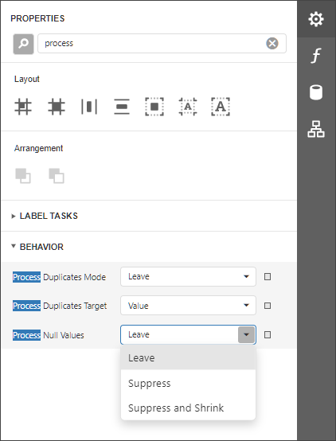
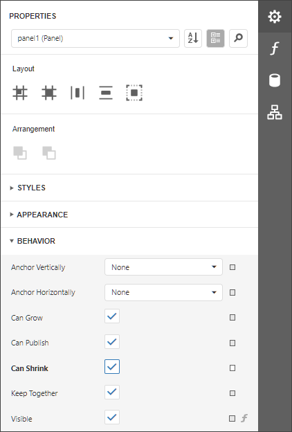

# Suppress Controls

## Avoid Duplicated and Empty Values

When identical or null values appear in a report's data source, you can suppress these values in a report using the following properties:

* **Process Duplicates Mode**
	
	Specifies how to process report controls with identical values (leave them as is, merge, suppress, or suppress and shrink).

* **Process Null Values**
	
	Specifies how to process report controls receiving null values from a data source (leave them as is, suppress, or suppress and shrink).

* **Process Duplicates Target**
	
	Specifies whether to process duplicate the control's **Text** or **Tag** property values.

These properties are available for the following controls:

* [Barcode](../use-report-elements/use-bar-codes.md)
* [Label](../use-report-elements/use-basic-report-controls/label.md)
* [Character Comb](../use-report-elements/use-basic-report-controls/character-comb.md)
* [Rich Text](../use-report-elements/use-basic-report-controls/rich-text.md)
* [Table Cell](../use-report-elements/use-tables.md)
* [Picture Box](../use-report-elements/use-basic-report-controls/picture-box.md)

## Conditionally Suppress a Control

You can suppress a control when a specified logical condition is met by specifying the required **Visible** property expressions as described in the [Conditionally Suppress Controls](../shape-report-data/specify-conditions-for-report-elements/conditionally-supress-controls.md) topic.

In this case, a space remains in the band at the control's location. You can avoid this by placing these controls onto an [Panel](../use-report-elements/use-basic-report-controls/panel.md) and setting its **Can Shrink** property to **true**.

For this feature to work correctly, consider the following:

* Specify the **Visible** property's expression to the controls in the panel (and not to the panel itself).
* Do not assign borders to the panel container. Otherwise, they are printed when the panel's content is suppressed.