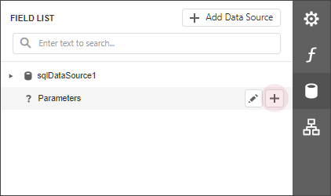
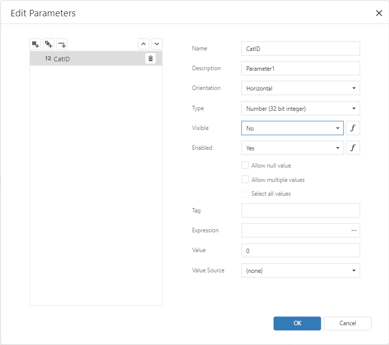
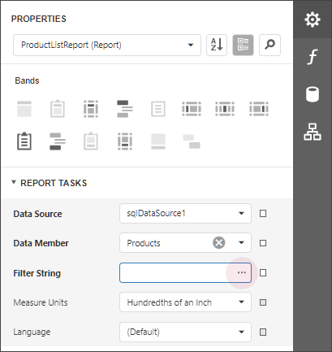
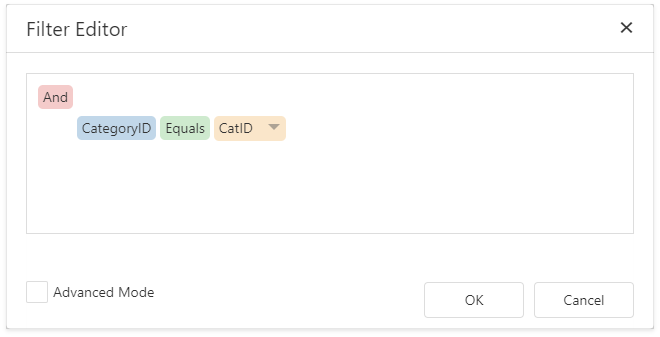
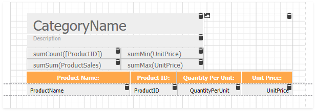
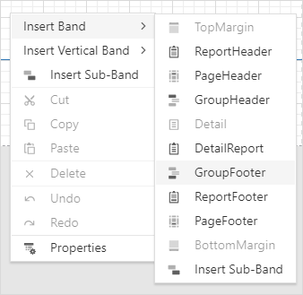
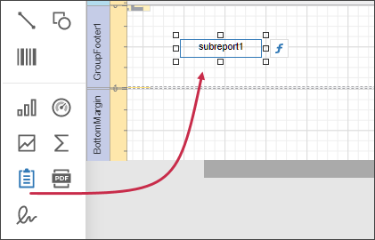
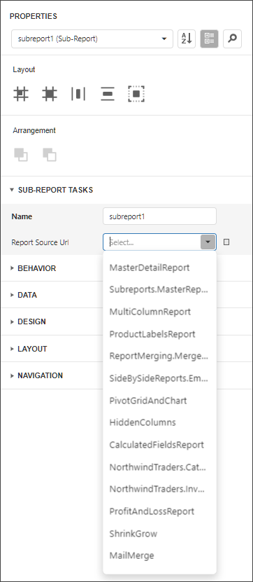
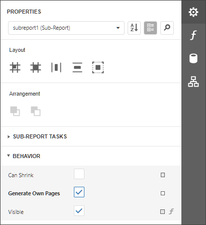
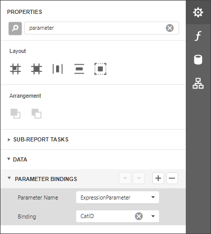

# Use Data-Driven Page Sequence

This topic describes how to combine a table report that uses Portrait page orientation and a chart report that uses Landscape page orientation.

Follow the steps below to create a combined report:

## Create a Chart Report

1. Create a report that shows data in the chart form. [Bind](../bind-to-data/bind-a-report-to-a-database.md) the report to a data source. Set the report's **Landscape** property to **true** to enable the Landscape page orientation.

    

1. Add a parameter to your chart report to identify which data to use for the chart. Switch to the **Field List** tab and click the **Parameters** node's plus button.

    

1. Click the created parameter's edit button and set its **Name** and **Type**, and uncheck the **Visible** option.

    

1. Switch to the report's **Properties** tab. Click the **Filter String** option's ellipsis button.

    

1. In the [Filter Editor](../shape-report-data/filter-data/filter-data-at-the-report-level.md) dialog, construct an expression to compare the key data field to the created parameter.

    

1. Save the report.

## Create the Base Report

1. Create a report [bound](../bind-to-data/bind-a-report-to-a-database.md) to the same data source as the chart report, and arrange a layout like the one shown below:

    

2. Invoke the context menu and and click **Insert Group Footer Band**.

	

3. Drag a [Subreport](../use-report-elements/use-basic-report-controls/subreport.md) item from the Toolbox onto the added group footer band.

    

4. Select the subreport control. In the **Subreport Tasks** group, set the **Report Source Url** parameter to the chart report.

    

5. Enable the **Generate Own Pages** option to print the embedded report on separate pages and use its own page settings.

    

6. Bind the subreport's parameter used as a filter criterion to the master report's data field that serves as a source of the parameter value. Expand the **Data** category, select the **Parameter Bindings** section and add a new parameter binding. In the binding properties list, specify the data field to bind a subreport parameter to, and the parameter you want to bind.

    

7. Switch to Preview mode to see the combined report.

    

Your base report's **Table of Contents** and **Document Map** include bookmarks from the embedded report. Use the **Parent Bookmark** property to specify the nesting level for the embedded report's bookmarks.
