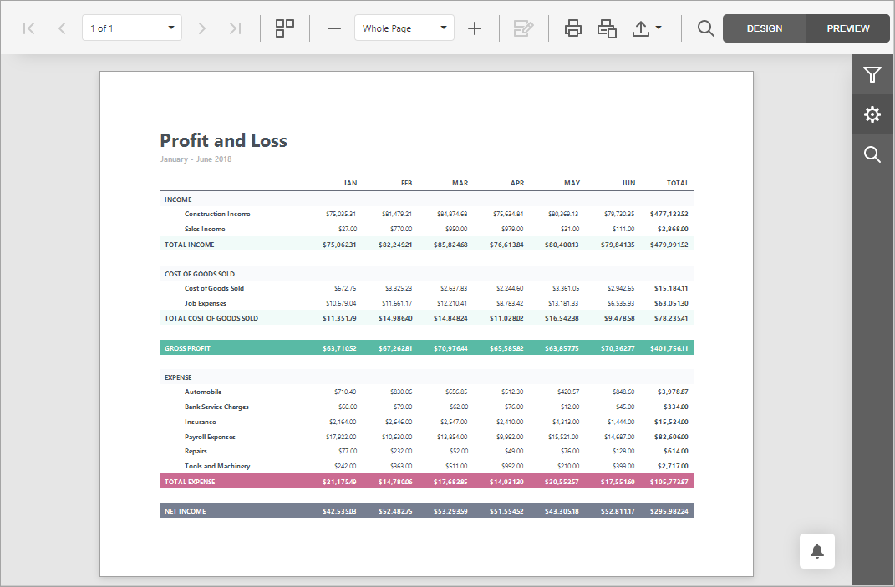
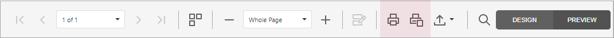
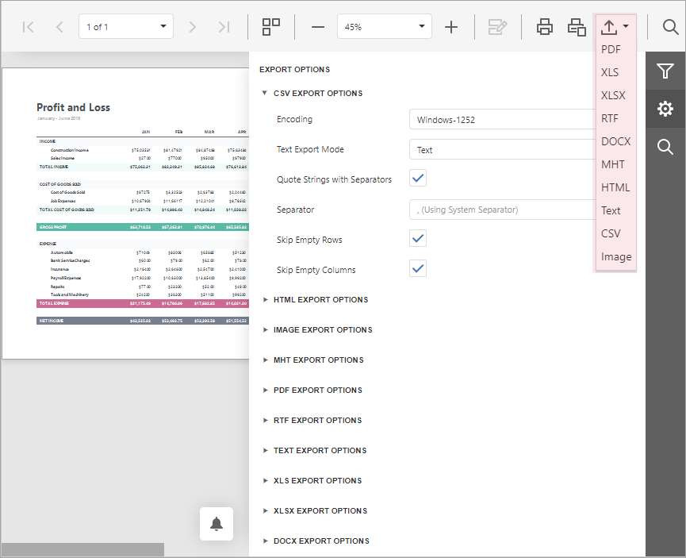

# Preview, Print and Export Reports

## Preview a Report
To switch a report to the print preview mode, click the **Preview** button on the [toolbar](report-designer-tools/toolbar.md). You will see your report populated with data and broken down into pages.

> [!NOTE]
> To learn more about the options available in the print preview mode, refer to the [Document Viewer](../document-viewer.md) section of this documentation.

## Print a Report

When in the Preview mode, you can use toolbar commands to print out your report.

## Export a Report
When in the Preview mode, you can export your report to files in different formats.

The following documents describe the basics of report exporting and format-specific export options.
* [Export a Document](../document-viewer/exporting/export-a-document.md)
* [CSV-Specific Export Options](../document-viewer/exporting/csv-specific-export-options.md)
* [HTML-Specific Export Options](../document-viewer/exporting/html-specific-export-options.md)
* [Image-Specific Export Options](../document-viewer/exporting/image-specific-export-options.md)
* [MHT-Specific Export Options](../document-viewer/exporting/mht-specific-export-options.md)
* [PDF-Specific Export Options](../document-viewer/exporting/pdf-specific-export-options.md)
* [RTF-Specific Export Options](../document-viewer/exporting/rtf-specific-export-options.md)
* [Text-Specific Export Options](../document-viewer/exporting/text-specific-export-options.md)
* [XLS-Specific Export Options](../document-viewer/exporting/xls-specific-export-options.md)
* [XLSX-Specific Export Options](../document-viewer/exporting/xlsx-specific-export-options.md)
* [DOCX-Specific Export Options](../document-viewer/exporting/docx-specific-export-options.md)

