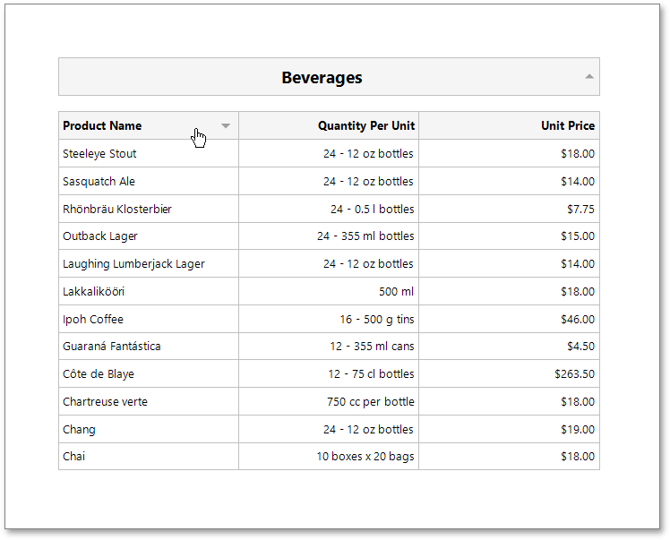

# Sort a Report in Print Preview

This tutorial illustrates how to enable sorting report data in Print Preview.

In this tutorial, we will start with the following report displaying products [grouped](../shape-report-data/group-and-sort-data/group-data.md) by category names.

You can implement interactive sorting for both the detail data and report groups.

## Sort Report Groups
To enable sorting report groups in Print Preview, select the label displaying product category names located in the **Group Header** band and switch to the [Properties](../report-designer-tools/ui-panels/properties-panel.md) panel.

Expand the **Behavior** category, select the **Interactive Sorting** section, and set the **Target Band** property to *GroupHeader1*. Set the **Field Name** property to *CategoryName*.

Switch to the **Preview** tab to sort report groups by the **CategoryName** field. When a mouse pointer hovers over the category name, it changes to a hand indicating the sorting capability. The arrow displayed at the element's right edge indicates the sorting order.

## Sort Detail Data
To enable sorting data in the Detail band, select the table cell displaying the **Product Name** title and switch to the [Properties](../report-designer-tools/ui-panels/properties-panel.md) panel.

Set the **Target Band** property to *Detail* and expand the **Sort Fields** section and add a new sort field to sort detail data by the product name. Set the table cell's **Field Name** property to the _ProductName_ field.

On switching to the Preview tab, you can now sort data in the Detail band by the **ProductName** field.

If you provide interactive sorting to multiple fields, clicking another field clears all the previously applied data sorting. Hold the SHIFT key while clicking to preserve the existing sorting settings and thus sort against multiple fields.

To disable data sorting against a specific field, hold the CTRL key on its caption click.

> [!NOTE]
> Reports embedded into the current report using the [Subreport](../use-report-elements/use-basic-report-controls/subreport.md) control do not support interactive data sorting.