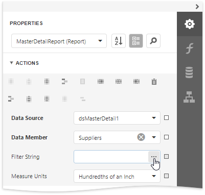
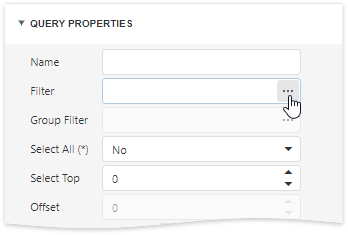

# Filter Editor

This document describes the Filter Editor available in the [End-User Report Designer](../../report-designer.md).

## Filter Editor Overview

The **Filter Editor** provides a visual interface for constructing filter criteria of varying complexity with an unlimited number of filter conditions combined by logical operators.

A filter condition consists of three parts:

* A field of a data source to which a report is bound.
* Criteria operator, such as **Equals**, **Is less than**, **Is between**, etc.
* A static operand value, another data field or a report parameter.

You can arrange specific conditions into groups with **And**, **Or**, **No And** , and **Not Or** operators.

## Invoke the Filter Editor
You can invoke the Filter Editor in one of the following ways:

* In the [Properties](ui-panels/properties-panel.md) panel, click the ellipsis button for the report's **Filter String** property to filter data at the report level.

    

* In the [Query Builder](query-builder.md), click the ellipsis button for the **Filter** or **Group Filter** property to filter data at the data source level.    

    

## Tree-Like Filtering

The Filter Editor displays filter criteria as a tree where individual nodes specify simple filter conditions. The root node is the logical operator combining all the conditions.

Click the plus button next to the operator to add a new condition or group.

You can select the required data field and comparison operator from the corresponding drop-down lists and enter an operand value in the dedicated value box.

Expand the drop-down menu for a value placeholder and select **Property** or **Parameter** to compare a data field with another data field or a report parameter. Then, click the converted placeholder and select the required item.

You can change the logical operator by clicking it and selecting the desired type.

Click the filter condition's  button to delete it.

## Text-Based Filtering

In the advanced mode, the Filter Editor allows you to type a filter string manually.

Refer to the [Expression Language](../use-expressions/expression-language.md) topic for the list of available operators and functions and for details on their usage.

This editor supports intelligent code completion (suggesting functions and available data columns as you type).

The  icon appears if a condition contains any errors.