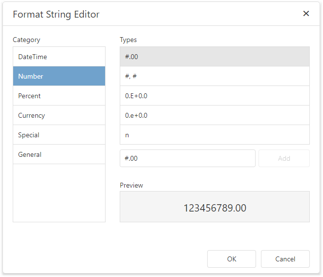
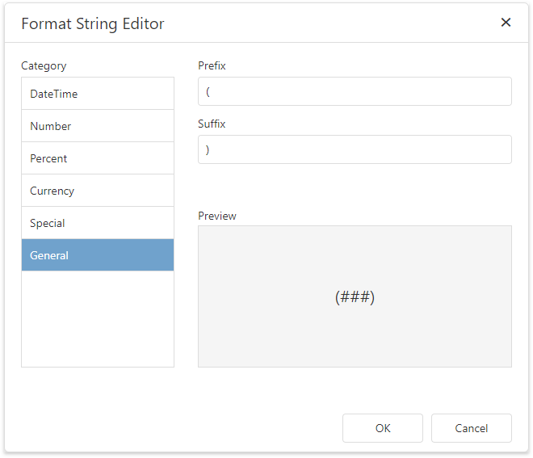
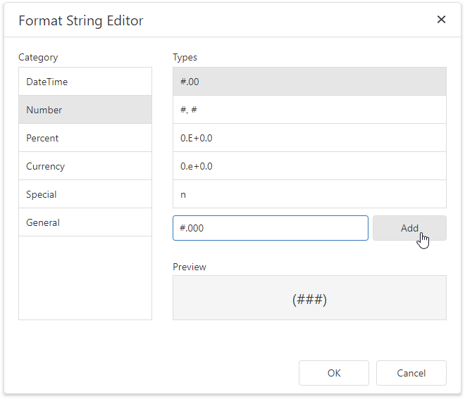
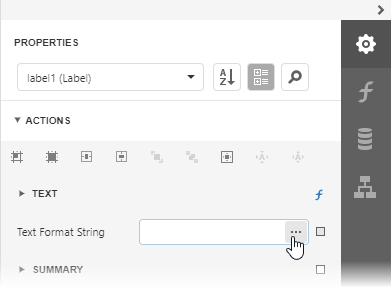
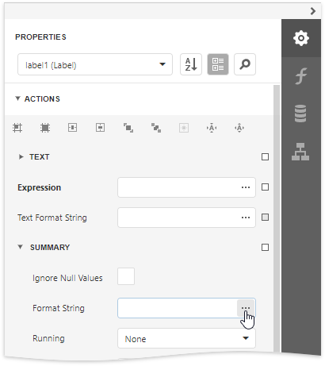

# Format String Editor

The **Format String Editor** provides the capability to apply the required formatting for report elements to display their incoming data. It allows you to easily select one of the built-in formats or create your own. For instance, you can format a numeric value as currency, display a date/time value in one of the standard forms depending on the culture, etc.

## Use Standard Formats

The Format String Editor contains numerous built-in formatting presets grouped by categories.

All categories are displayed in the **Category** list on the left side. The **Types** list on the right side contains formats available within the selected category. The editor also allows you to see the preview of the selected format in the **Preview** section.

## Use General Formats

In the **General** category, you can enter the **Prefix** and **Suffix** specifying custom text that will be added before and after the output value, respectively.

## Create Custom Formats
To create a custom format, enter the format string in the dedicated editor and click **Add**. The format will be added to the end of the **Types** list and automatically selected.

You can then remove a custom format by clicking the corresponding  button.

## Run the Format String Editor

You can invoke the Format String Editor to format values of a control's bindable properties (not the control's static content) and summary values.

* **Basic Formatting**

    It is common to format an [Label](../use-report-elements/use-basic-report-controls/label.md)'s **Label Text** property. To do this, expand the **Tasks** or **Data** category and click the ellipsis button for the **Text Format String** property.

    

* **Formatting Summaries**

    When a summary function is applied to a control's dynamic content, value formatting is specified separately. To do this, expand the **Label Tasks** or **Data** category. Then, in the **Summary** section, click the ellipsis button for the **Format String** property.

    

    The summary format has priority over the general value format.
      

