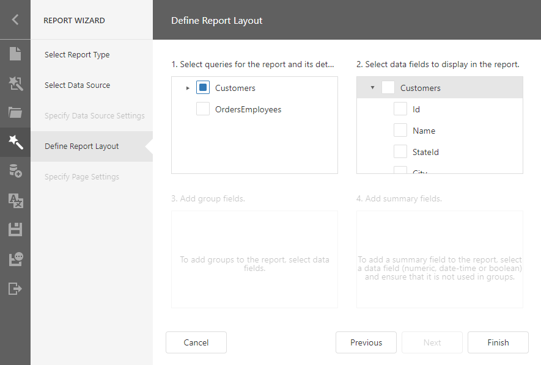
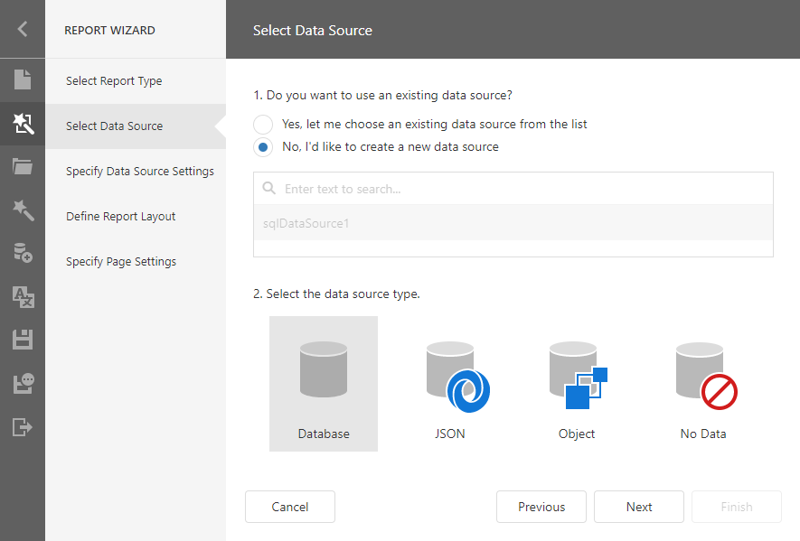

# Select Data Source

On this wizard page, you can select an existing data source or create a new data source.

## Select an Existing Data Source

Select the first option and choose a data source from the list.

* If you create a new report, the list displays the Report Designer's predefined data sources.
* If you edit an existing report, the list contains the Report Designer's predefined data sources and data sources added to the current report with the [Data Source Wizard](../../data-source-wizard.md).

If the report and Report Designer have data sources with identical names, this list displays the report's data source.

Click **Next** to go to the [Define Report Layout](define-report-layout.md) page.

## Create a New Data Source

Choose _'No, I'd like to create a new data source'_ and select the data source type.

> [!Note]
> You can create new data sources only if corresponding data connections are registered in the Report Designer.

Click **Next** to proceed:

* [Spesify Data Source Setting (Database)](specify-data-source-settings-database.md) if you selected **Database**;
* [Spesify Data Sourse Setting (JSON)](specify-data-source-settings-json.md) if you selected **JSON**.

