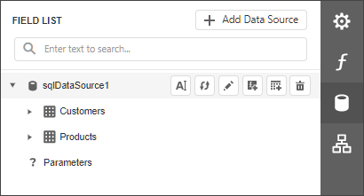
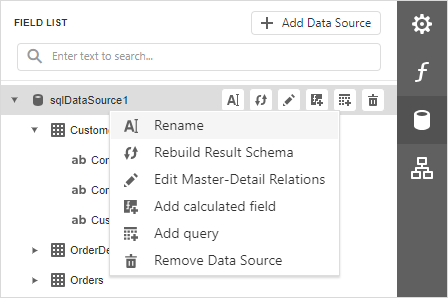
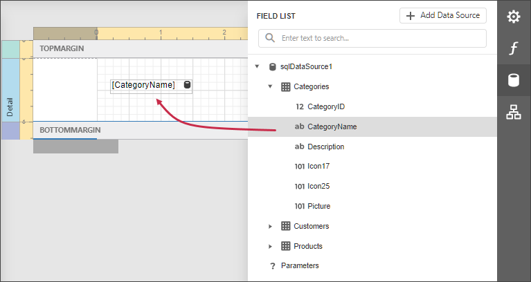
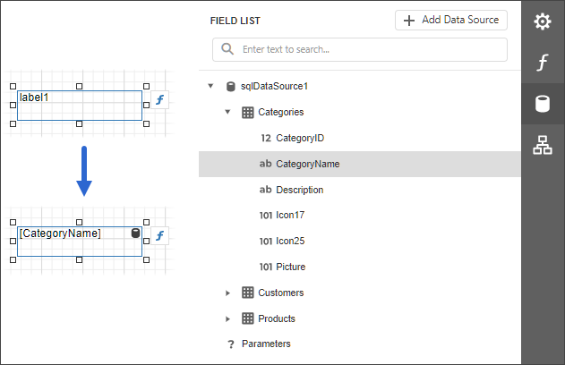
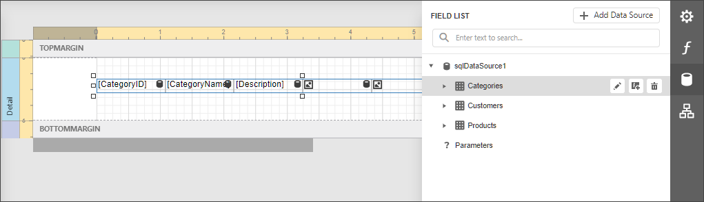
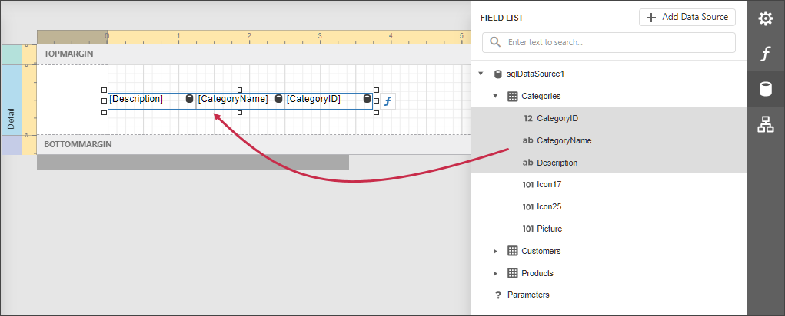
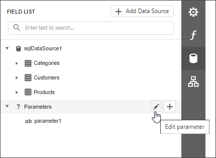
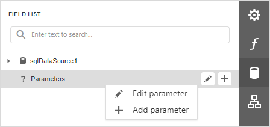

# Field List

The **Field List** displays the schema of a report's data sources. This panel enables you to manage report data sources and parameters, add calculated fields and create bound report controls.

## Manage Report Data Sources

The Field List shows available report data sources and their structure.

The following actions are available in the Field List for data source customization:

| Button | Description |
|---|---|
|  | Invokes the Data Source Wizard. |
|  | Renames the selected data source. |
|  | Rebuilds the result schema for the selected data source. |
|  | Invokes the [Master-Detail Relation Editor](../master-detail-relation-editor.md). |
|  | Adds a calculated field. |
|  | Invokes the **Create a Query or Select a Stored Procedure** wizard page. |
|  | Removes the selected data source. |

The following actions are available for query customization:

| Button | Description |
|---|---|
|  | Removes the selected query. |
|  | Invokes the **Create a Query or Select a Stored Procedure** wizard page. |

You can also right-click a data source to access these actions in a context menu:

## Bind controls to data

Dropping a field onto a report's surface creates a new report control bound to a corresponding field.

Dropping a field onto an existing control binds this control to a corresponding field.

## Create tables

Dropping an entire data table onto a report creates a table with its columns bound to fields contained in the data table.

To select multiple fields, click them with holding the CTRL or SHIFT key. Dropping these fields onto a report creates a new table with its cells bound to the corresponding fields.

## Data shaping operations

In addition, the Field List can help you solve the following tasks:

* Add [calculated fields](../../shape-report-data/use-calculated-fields/calculated-fields-overview.md) to data columns for performing various calculations in a report.
	
	
* Manage the collection of [report parameters](../../use-report-parameters.md).
	
	

You can also right-click a parameter to access these actions in a context menu:

