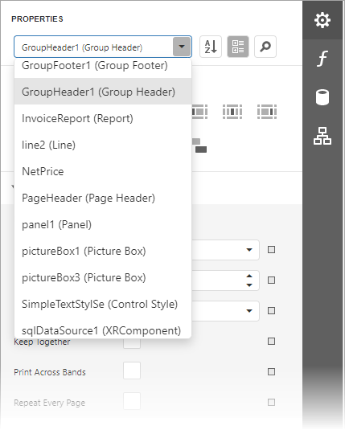
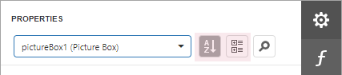
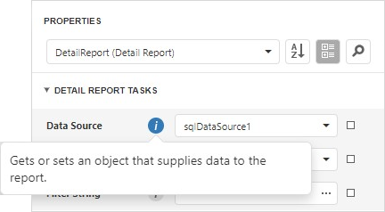
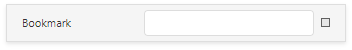
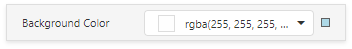
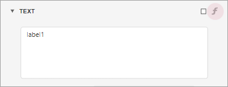
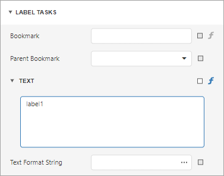
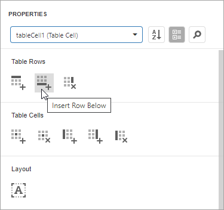
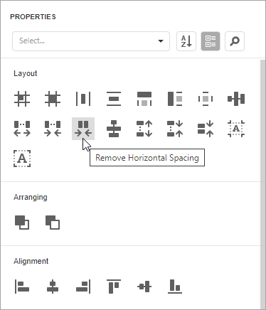

# Properties Panel

This document describes how to use the **Properties** panel to access and customize the report and report element properties.

## Select a Report Element

Do one of the following to access an element's properties:

* Select an element from the drop-down list at the top of the **Properties** panel.
	
	

* Select an element on the [Design Surface](../design-surface.md) and click the   tab on the side panel to invoke the **Properties** panel.
* Select an element in the [Report Explorer](report-explorer.md) panel and click the  button.
* Click an element’s smart tag to invoke a panel with the element’s most commonly used properties.

## Switch Between Display Modes

Element settings can appear in alphabetical order or in categories based on their purpose. Use the buttons next to the selected element to switch between these display modes.

## Display Property Descriptions

The Properties panel displays hints with property descriptions. To display the description, select the property and click the information symbol (**i**) to the left of the property editor:

If necessary, you can localize property descriptions. 

## Change Property Values

Each record consists of a property's caption, a value editor, and an optional property marker. To change a property's value, select the property and specify its value in the editor.

Certain properties contain nested properties which can be accessed when you click the header.

The property marker indicates if the property's value was changed:

* If a property stores a default value, its property marker is gray.

	

* If a property's value was changed, the property marker becomes white.

	

* If a [report style](../../customize-appearance/report-visual-styles.md) supersedes a property's value, the marker is light blue. This applies to appearance properties (for instance, an element's **BackColor**, **Font**, **Borders**).

	

## Reset Property Values

Click the property marker to the right of the editor. Select **Reset** in the invoked popup menu to restore the default property values.

> [!NOTE]
> The **Reset** command resets the expression and the value you specified in the property's editor.

## Specify Expressions

The **Properties** panel allows you to specify expressions that can calculate the value at runtime when a document is generated. Click the **f-marker** to invoke the [Expression Editor](../expression-editor.md).

Specify an expression in the invoked Expression Editor.

The **Properties** panel highlights properties that have an assigned expression.

## Search Properties

Click the  button to show the search box. When you type in the search box, the **Properties** panel filters the list of available properties and highlights the search string in the records.

## Use Actions

In the categorized mode, the **Properties** panel contains the context-sensitive **Actions** group that provides the most commonly used actions for the selected report element:

* Add new [bands](../../introduction-to-banded-reports.md), if you selected a report.
	
	

* Manage a table element's cells, rows, and columns.
	
	

* Align and position report elements (for instance, align and resize elements to the snap grid, specify horizontal and vertical alignments) for individual and multiple selected report elements.
	
	