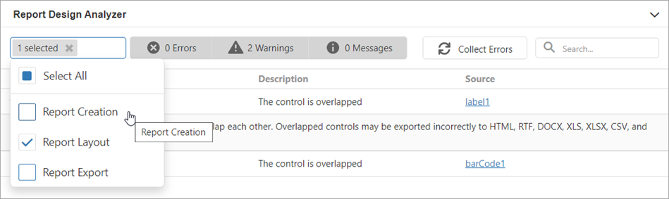

The **Report Design Analyzer** shows errors, warnings, and information messages that help you to detect and fix issues in a report.

## Invoke the Report Design Analyzer

Click the **bell tab** in the bottom.

## Fix Issues

Each message contains a recommendation on how to fix an issue. Click the Plus icon in front of the message to expand the recommendation.

The **Source** column contains a reference to the control or script that caused the issue. Click the reference to navigate to this control or script.

## Filter Messages by Source

Based on their source, report errors are divided into four groups:

* Report layout errors – occur, for example, when report controls overlap each other or extend beyond the report’s printable area.
* Report creation errors – occur while the report document is created. For instance, it might include notifications about invalid property values or unreachable sources of content.
* Report export errors – happen while the report document is exported to PDF, XLSX, and other formats.
* Report script errors (this group is not displayed if report scripts are disabled in your application) – for example, errors in script syntax.

You can disable messages that belong to a particular source:

## Filter Messages by Type

You can enable/disable messages of each available type ("Error", "Warning", or "Information") or any combination of them. Click the panel in the UI as shown in the image below to enable/disable messages of a corresponding type.

