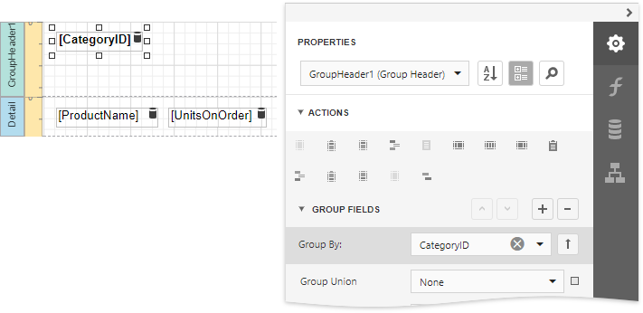
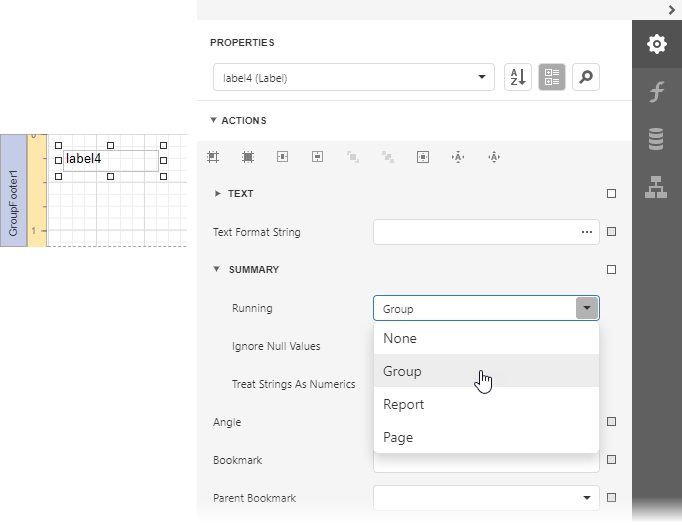
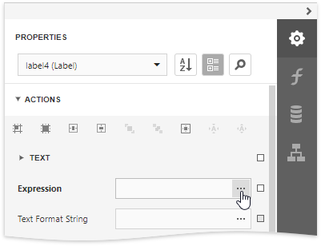
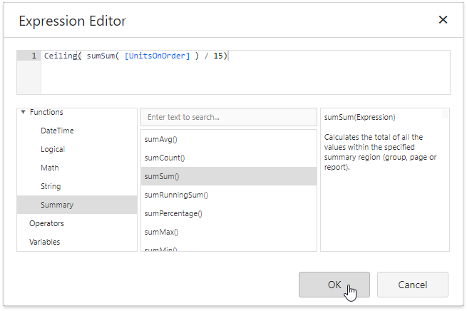
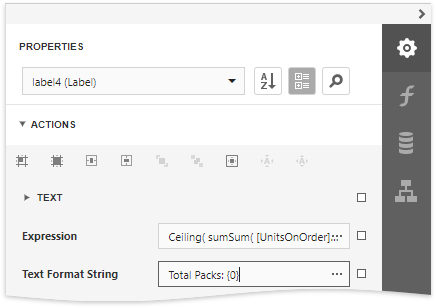
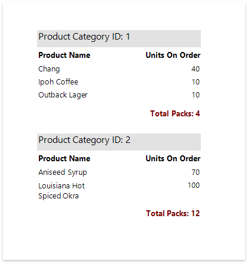

# Calculate an Advanced Summary

This document describes how to calculate an advanced summary for report groups using a built-in summary function and arithmetical or logical functions.

1. [Create a new report](../../add-new-reports.md) or open an existing one and [bind it to a data source](../../bind-to-data.md).

2. Insert the [Group Header](../../introduction-to-banded-reports.md) band, select the **Group Fields** section in the **Group Header Tasks** category and add a new group field to group the report's data by the required field. 

    

3. Insert the Group Footer band and drop a [Label](../../use-report-elements/use-basic-report-controls/label.md) onto it to display the summary result. Expand the **Summary** section in the **Label Tasks** category and set the **Running** property to **Group**.

    

4. Click the ellipsis button for the label's **Expression** property.

    

5. This invokes the [Expression Editor](../../report-designer-tools/expression-editor.md) where you can specify a custom expression with the required summary functions and other logical or arithmetical functions. For example:

    

	> [!TIP]
	> See the [Functions in Expressions](../../use-expressions/functions-in-expressions.md) topic for a complete list of supported summary functions.

6. You can use the **Text Format String** property to format the summary's value.
	
	

Switch to [Print Preview](../../preview-print-and-export-reports.md) to see the result.

