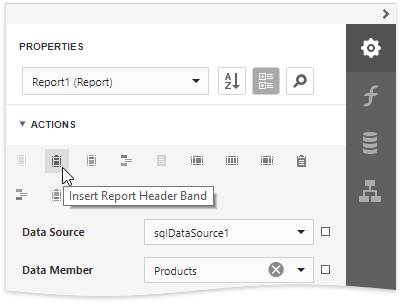
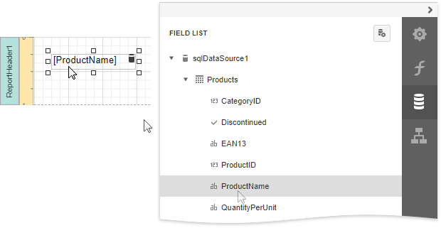
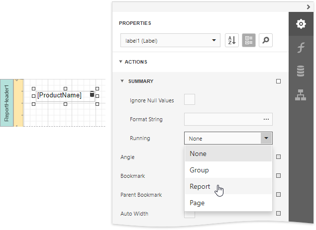
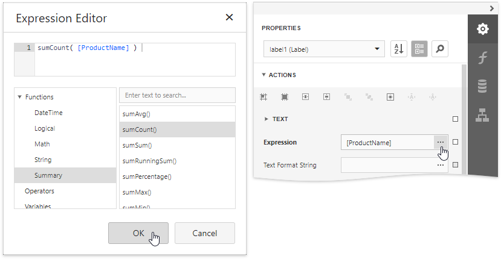
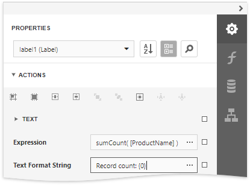
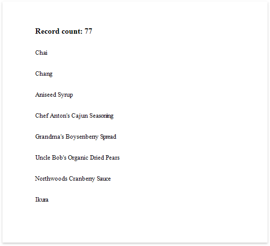

# Count the Number of Records in a Report or Group

This document describes how to display the number or records in a report or group.

1. Select the corresponding command from the  and insert a [Report Header](../../introduction-to-banded-reports.md) or Footer to display the record count for the entire report.
	
	
	
	> [!Note]
	> Use a Group Header/Footer for displaying record counts for groups, and a Page Header/Footer for displaying record counts for pages.

2. Switch to the [Field List](../../report-designer-tools/ui-panels/field-list.md) panel and drop the corresponding data table field onto the created band to create a data-bound label.
	
	

3. Expand the **Summary** section in the **Tasks** category and invoke the **Running** drop-down list. Select **Report** to count the records throughout the entire report, or select **Group** or **Page** to reset the record count for every group or page.
	
	

4. Click the **Expression** property's ellipsis button. In the invoked [Expression Editor](../../report-designer-tools/expression-editor.md), select the **sumCount** function in the **Functions** | **Summary** section.
	
	

5. Use the **Text Format String** property to format the resulting value.
	
	

You can switch to [Print Preview](../../preview-print-and-export-reports.md) to see the resulting report.

