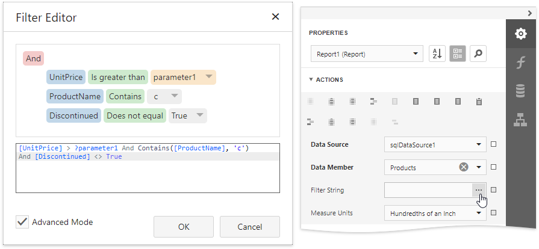
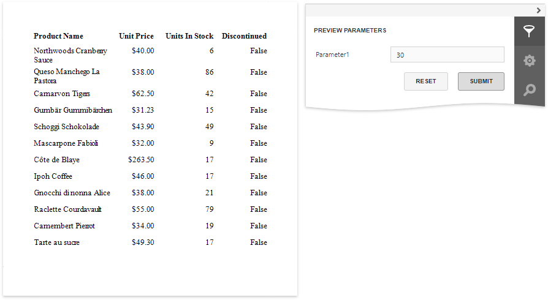

# Filter Data at the Report Level

This tutorial illustrates how to filter data at the report level, as opposed to the [data source level](filter-data-at-the-data-source-level.md). This approach is useful when dealing with relatively small data sources, when data load times are acceptable.

1. [Create a new report](../../add-new-reports.md) or open an existing one.

2. Bind you report to a required data source. See the [Bind to Data](../../bind-to-data.md) section to learn more about providing data to reports.

3. Switch to the [Field List](../../report-designer-tools/ui-panels/field-list.md) panel and drop the required fields onto the report's [Detail](../../introduction-to-banded-reports.md) band.

    

4. Expand the **Tasks** category and click the **Filter String** property's ellipsis button.

    In the invoked [Filter Editor](../../report-designer-tools/filter-editor.md), construct an expression in which the data fields are compared with the required values.

    

    Every filter condition consists of three parts:
    * A field of a data source to which a report is bound or the name of the [calculated field](../use-calculated-fields.md), which exists in this data source at the same level.
    * Criteria operator, such as **Equals**, **Is less than**, **Is between**, etc.
    * A static operand value, another data field or a [report parameter](../../use-report-parameters.md). To access parameters, click the icon on the right until it turns into a question mark.

    You can arrange specific conditions into groups with **And**, **Or**, **Not And**, and **Not Or** operators.

Your report is now ready to be generated. Switch to [Print Preview](../../preview-print-and-export-reports.md) to see the result.

