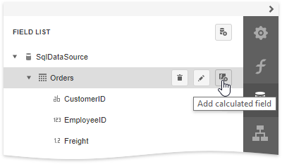
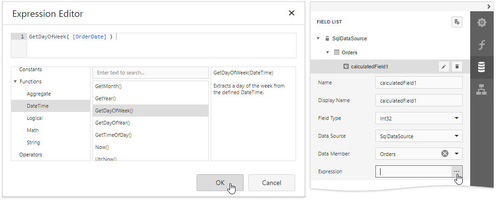
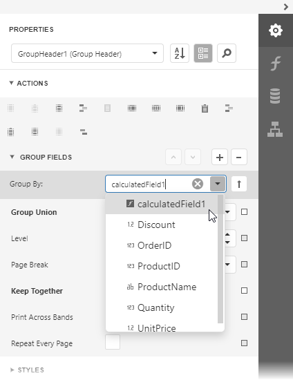
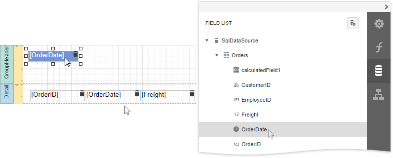
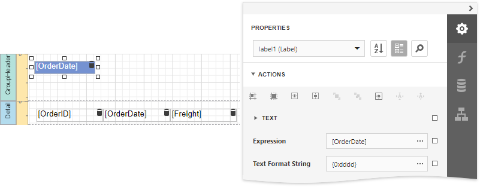
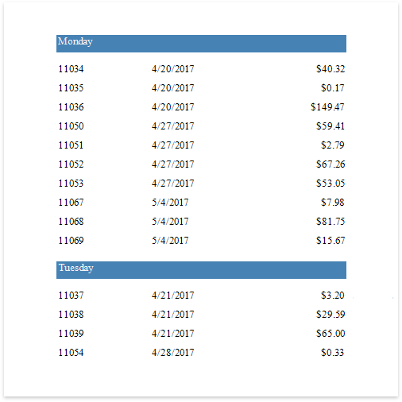

# Group Data by a Custom Field

This tutorial illustrates how to group a report against a custom criteria, in particular, group data by days of the week. 

1. Create a new or open an existing data-bound report.
	
	You cannot apply grouping unless your report is bound to a data source.

2. Create a [calculated field](../use-calculated-fields.md). Switch to the [Field List](../../report-designer-tools/ui-panels/field-list.md) panel, select the data source or a table inside it and click **Add Calculated Field**.
	
		

3. Click the **Edit** button for the calculated field and then click the **Expression** property's ellipsis button. In the invoked [Expression Editor](../../report-designer-tools/expression-editor.md), select the required date-time function and define the data field's name in **[**square brackets**]**. For example,  use the **GetDayOfWeek([OrderDate])** function to return a zero-based index of the day of the week, extracted from the **OrderDate** data field.
	
	
	
	Click **OK** to close the editor and save the changes.
4. Insert the [Group Header](../../introduction-to-banded-reports.md) band,  select the **Group Fields** section in the **Group Header Tasks** category and add a new group field to group the report's data by the calculated field. 
		
	
	
	Click the  or  buttons to define the sort order within the group (ascending or descending). Use the  button to disable sorting in grouped data.

5. Switch to the **Field List** and drop the required data fields onto the report's area.

    

6. Select the label in the Group Header and set the **Text Format String** property to **{0:dddd}**. This makes the label only display the day of the week, and not the date.
	
	

Switch to [Print Preview](../../preview-print-and-export-reports.md) to see the result.

