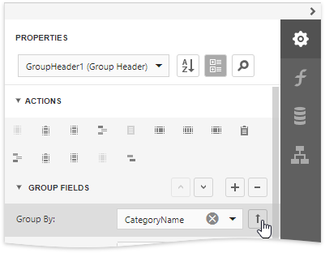
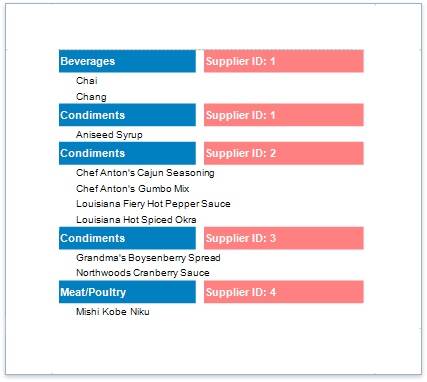

# Group Data

## Group a Report's Data
Do the following to group data in your report:

1. Create a new or open an existing data-bound report.
	
	You cannot apply grouping unless your report is bound to a data source.
2. Insert the [Group Header](../../introduction-to-banded-reports.md) band, select the **Group Fields** section in the **Group Header Tasks** category and add a new group field to group the report's data by the required data field.
	
	
	
	> [!Note]
	> See the [Group Data by a Custom Field](group-data-by-a-custom-field.md) tutorial to learn how to group a report's data by a custom field.

3. Click the  or 
 buttons to define the  sort order within the group (ascending or descending). 
    
    Use the  button if your groups are already ordered in the data source, and you do not need to sort them in the report.

        
	
1. Click the plus button for the **Group Fields** section to create a new group field and specify its **Field Name** property.    
    
    Use the **Move Up** and **Move Down** buttons to specify the order in which these criteria are applied to the report's data.
		
	
    	
	The following images illustrate how a report looks when it is grouped by multiple criteria:
	
	| A single group with multiple group fields | Nested group header bands |
	|---|---|
	|  |  |

2. Drag the corresponding field from the [Field List](../../report-designer-tools/ui-panels/field-list.md) panel and drop it onto the group header to display the group field's value in the report.
	
	

The resulting report looks as follows:

## Specify the Group's Settings
Expand the **Group Fields** section to customize the group's layout settings:

* Use the **Group Union** property to keep a group's content on the same page when possible.
	
	

* Use the **Keep Together** property to print the Group Header/Footer on the same page as the group's contents.
	
	

* Use the **Repeat Every Page** property to print the group band on each page.
	
	

* Use the **Page Break** property to start a new page before or after each group.
	
	

When you need to display page numbers for individual groups, add the [Page Info](../../use-report-elements/use-basic-report-controls/page-info.md) control to the Group Header or Footer and set its **Running Band** property to the Group Header's name.
	

	
Accurate page numbering requires that different groups do not appear on the same page. For this reason, you need to set the Group Footer's **Page Break** property to **After Band**, or place the **Page Break** control at the band's bottom.
	
