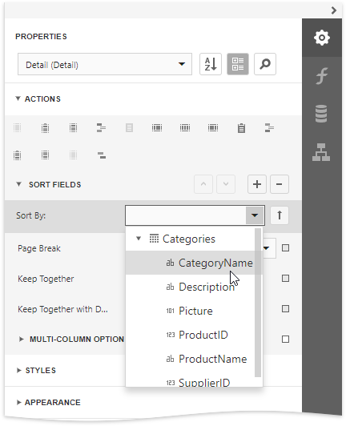
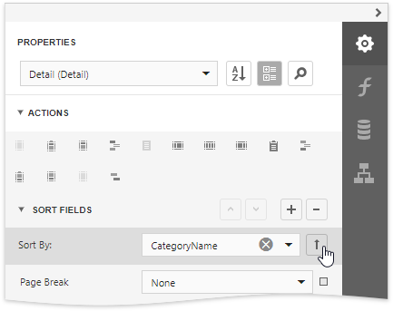
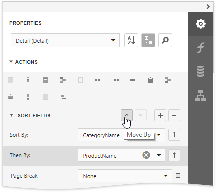
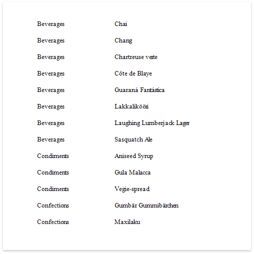
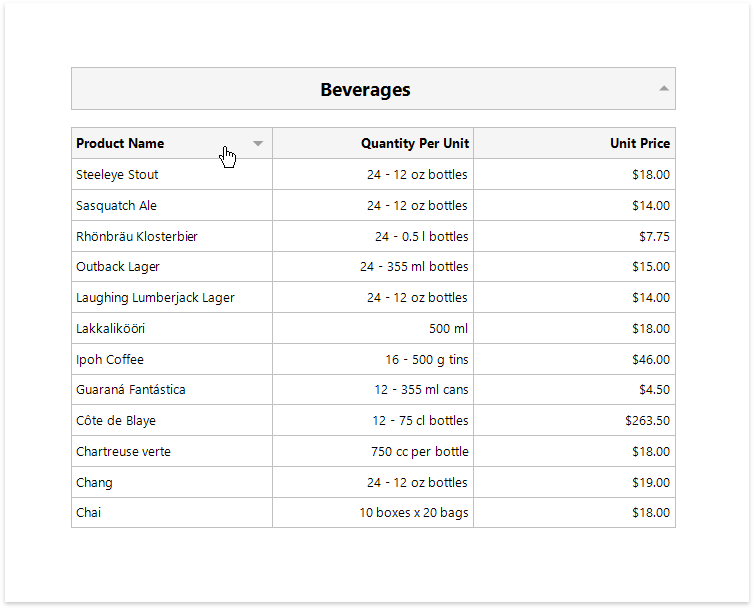

# Sort Data

## Sort a Report's Data
Do the followebg to sort data in your report:

1. Create a new or open an existing data-bound report.
	
	You cannot apply sorting unless your report is bound to a data source.
2. Switch to the [Properties](../../report-designer-tools/ui-panels/properties-panel.md) panel and select the [Detail](../../introduction-to-banded-reports.md) band. Select the **Sort Fields** section in the **Detail Tasks** category and add a new sort field to sort the report's data by the required data field.
	
	
	
	> [!Note]
	> See the [Sort Data by a Custom Field](sort-data-by-a-custom-field.md) tutorial to learn how to sort a report's data by a custom field.
	
	This adds a corresponding sort field to the **Sort Fields** collection. You can access this collection by expanding the sort field section.
		

3. Click the  or  buttons to define the sort order within the group (ascending or descending). Use the  button to disable sorting in grouped data.
		
	
		
4. When a report has multiple sort fields, you can change their order by clicking **Move Up** or **Move Down**.
	
	
	
6. Drag the corresponding field from the [Field List](../../report-designer-tools/ui-panels/field-list.md) onto the report area and switch to [Print Preview](../../preview-print-and-export-reports.md) to see the result.

    

## Interactive Sorting in Print Preview
You can allow sorting report data directly in Print Preview by clicking a designated element.

See [Sort a Report in Print Preview](../../provide-interactivity/sort-a-report-in-print-preview.md) for more information.