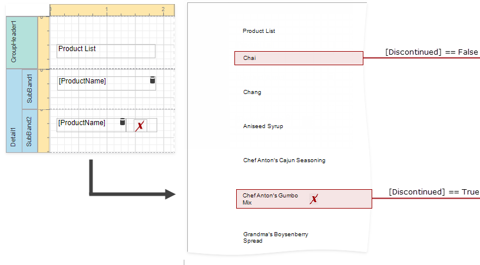

# Conditionally Change a Band's Visibility

This topic describes how to change report band visibility.

Set a band's **Visible** property to an expression to conditionally change the band's visibility based on a field's value or a parameter.

The report created in this tutorial contains two Detail **sub-bands** with different report controls. These sub-bands are used to display discontinued and current products.   

The steps below demonstrate how to change a band's visibility based on a field's value.

1. Select the required band and switch to the **Expressions** panel. Click the **Visible** property's ellipsis button.

    

2. In the invoked **Expression Editor**, specify the required expression.

       

    Here, the **[Discontinued] == false** expression is set for the **SubBand1** and the **[Discontinued] == true** expression for the **SubBand2**. These expressions specify the **Visible** property based on the **Discontinued** data field's value. 

The **Preview** below displays how changes to band visibility influence the Product List. The **SubBand1** is used to display products that have the **Discontinued** field set to **false**, and the **SubBand2** is used to display discontinued products.

