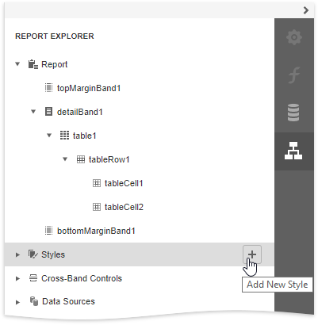
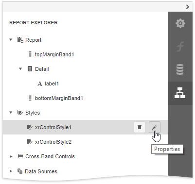
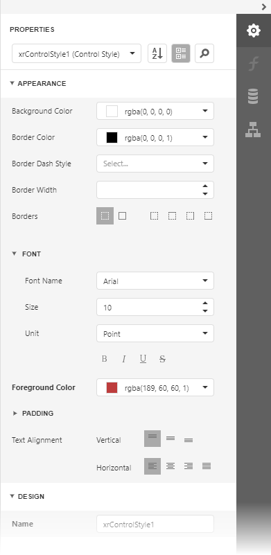
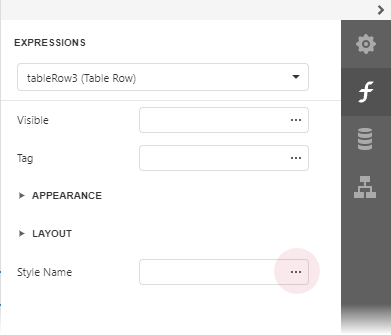
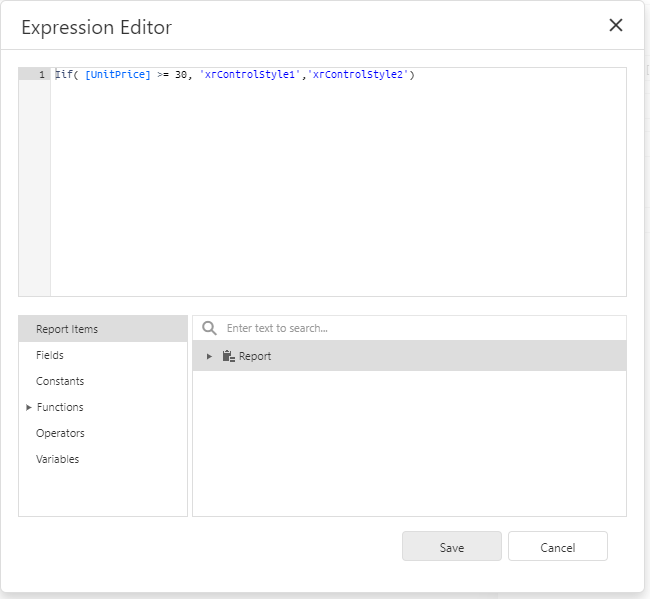

# Conditionally Change a Control's Appearance

This document describes how to change a report control's appearance based on a specific condition.

1. Switch to the [Report Explorer](../../report-designer-tools/ui-panels/report-explorer.md) panel, select the **Styles** node and click **Add New Style** to create a new visual style.
	
	

2. Click the created style and select **Properties**.
	
	

3. In the [Properties](../../report-designer-tools/ui-panels/properties-panel.md) panel, customize the created style's appearance settings.
	
	

4. Create another style 'xrControlStyle2' with default settings.

5. Select a report element to which you wish to specify a style selection rule (a table row with a cell bound to the 'UnitPrice' field), switch to the [Expressions](../../report-designer-tools/ui-panels/expressions-panel.md) panel, and click the ellipsis button next to the **Style Name** property.
	
	

6. In the invoked [Expression Editor](../../report-designer-tools/expression-editor.md), specify the style switch condition:

	`Iif( [UnitPrice] >= 30, 'xrControlStyle1','xrControlStyle2')`

	
	

7. Switch to [Print Preview](../../preview-print-and-export-reports.md) to view the results.

	