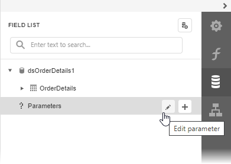
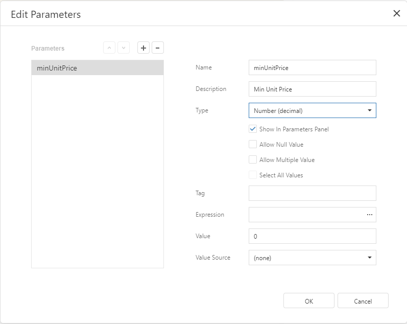
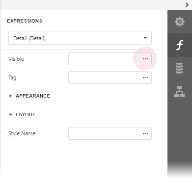
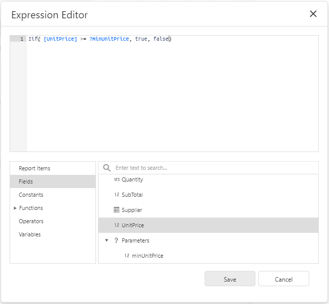
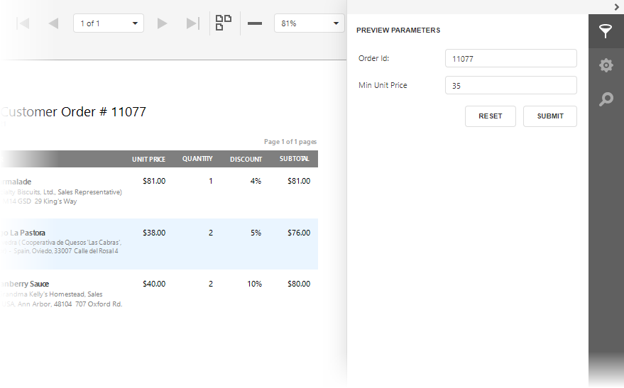

# Conditionally Filter Report Data

This document describes how to filter a report's data based on a specific condition.

1. Switch to the [Field List](../../report-designer-tools/ui-panels/field-list.md) panel, select the **Parameters** node and click **Add parameter**.
	
	

2. Specify the parameter name and description, set its type to **Number (decimal)**.
	
	

3. Select the report's detail band, switch to the [Expressions](../../report-designer-tools/ui-panels/expressions-panel.md) panel and click the **Visible** property's ellipsis button. 

	

4. In the invoked [Expression Editor](../../report-designer-tools/expression-editor.md), specify the visibility condition:

	`Iif( [UnitPrice] >= ?minUnitPrice, true, false)`
	
	
	
	The expression above makes the **Visible** property return **True** or **False** depending on whether the field value is greater or equal to the specified parameter value.

5. Switch to [Print Preview](../../preview-print-and-export-reports.md) to see the result. 

	