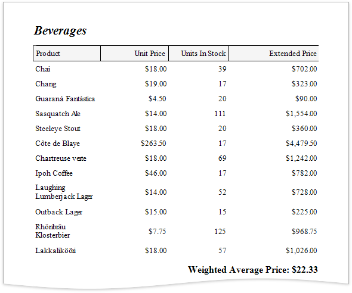
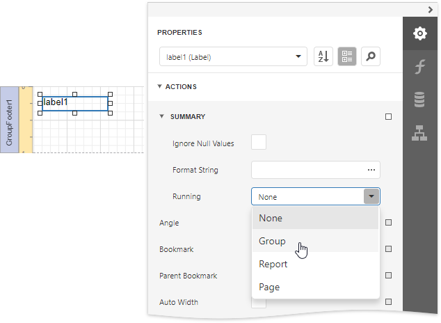
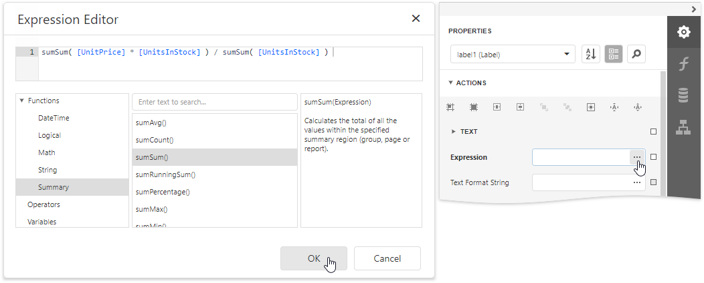
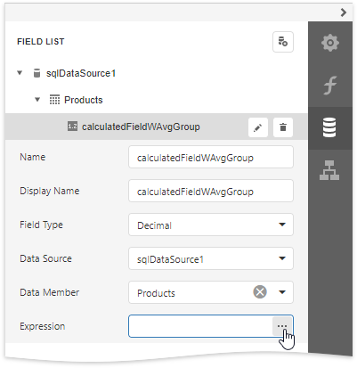
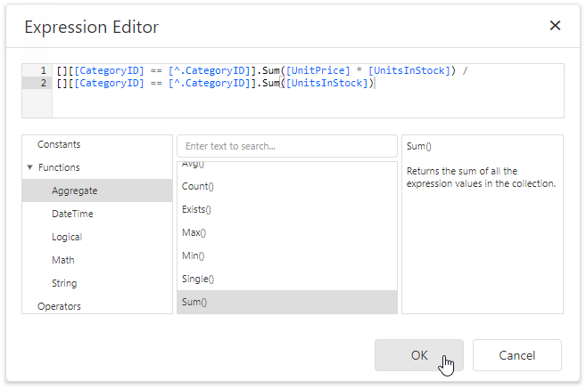

# Calculate a Weighted Average Function

This tutorial demonstrates how to calculate a weighted average function in a report, for instance, calculate a weighted average price for the units in stock within each product category: _Sum (Unit Price * Units In Stock) / Sum (Units In Stock)_.

## Use Report Summary Functions (Recommended)
You can calculate a weighted average by specifying a control's expression using several built-in report summary functions.

> [!NOTE]
> You can use this approach if expression bindings **are enabled** in the Report Designer (the Designer provides the [Expressions](../../report-designer-tools/ui-panels/expressions-panel.md) panel).

1. [Open an existing report](../../open-reports.md) or [create a new one from scratch](../../add-new-reports.md).
2. [Bind a report](../../bind-to-data.md) to a required data source. 
3. Insert the [Group Header](../../introduction-to-banded-reports.md) band,      select the **Group Fields** section in the **Group Header Tasks** category and add a      new group field to [group the report's data](../../shape-report-data/group-and-sort-data/group-data.md) by the required data field.
	
	
4. Construct a layout like the following:
	
	

5. Add the [Group Footer](../../introduction-to-banded-reports.md) band to the report and drop a [Label](../../use-report-elements/use-basic-report-controls/label.md) control on this band to display the summary result.
	
	Expand the **Summary** section in the **Label Tasks** category and set the **Running** property to **Group**.
	
	

6. Click the **Expression** property's ellipsis button. This invokes the [Expression Editor](../../report-designer-tools/expression-editor.md) where you can specify a custom expression with multiple built-in functions from the **Functions** | **Summary** section. Report summary functions start with the "sum" prefix to help differentiate them from aggregate functions.
	
	

7. You can also use the control's **Format String** property to format the summary's value. For instance, set this property to **Weighted Average Price: {0:c2}**.

## Use Aggregate Functions
You can create a [calculated field](calculated-fields-overview.md) and use a standard aggregate function in its expression to evaluate a weighted average.

1. [Open an existing report](../../open-reports.md) or [create a new one from scratch](../../add-new-reports.md).
2. [Bind a report](../../bind-to-data.md) to a required data source and construct the required report layout.
3. Switch to the [Field List](../../report-designer-tools/ui-panels/field-list.md), select a data table and click **Add calculated field**.
	
	
4. Click the **Edit** button for the calculated field to display calculated field properties. Specify the **Name** property, set the **Field Type** to **Decimal** and click the **Expression** property's ellipsis button.
	
	
5. In the invoked [Expression Editor](../../report-designer-tools/expression-editor.md), specify the expression using the **Sum** aggregate function. For example:
	
	_[][[CategoryID] == [^.CategoryID]].Sum([UnitPrice] * [UnitsInStock])  / [][[CategoryID] == [^.CategoryID]].Sum([UnitsInStock])_
	
	
	
	To construct a valid aggregate expression, use the following format, which consists of four parts.

    _[\<Collection>][\<Condition>].\<Aggregate>(\<Expression>)_

    * _\<Collection>_ - Specifies a collection against which an aggregated value should be calculated. It can be the relationship name in a case of a master-detail relationship, or the name of a collection property exposed by the target class. For example, _[CategoriesProducts][[CategoryId]>5].Count()_. Empty brackets [] indicate the root collection.
    * _\<Condition>_ - Specifies a condition defining which records should participate in calculating an aggregate function. To obtain an aggregated value against all records, delete this logical clause along with square brackets (for example, _[].Count()_).
    * _\<Aggregate>_ - Specifies one of the available aggregate functions.
    * _\<Expression>_ - Specifies an expression evaluating values to be used to perform calculation. For example, _[][[CategoryID] > 5].Sum([UnitPrice]*[Quantity])_. The **Count** function does not require field values to count the records, so leave the round brackets empty for this function.

    You can refer to the currently processed group using the Parent Relationship Traversal Operator ('^'). This allows you to calculate aggregates within groups using expressions like the following: _[][[^.CategoryID] == [CategoryID]].Sum([UnitPrice])_.

    For more information, see [Expression Language](../../use-expressions/expression-language.md).

6. Add the created calculated field to the report as an ordinary data field and format its value.