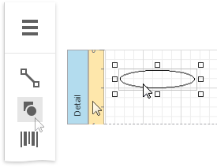
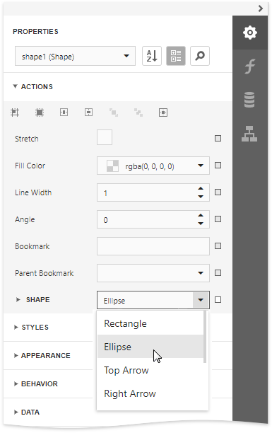

# Draw Shapes

The **Shape** control allows you to draw various shapes in a report.

To add a shape to a report, drag the **Shape** item from the [Toolbox](../../report-designer-tools/toolbox.md) onto the report's area.

Expand the **Tasks** category and use the **Shape** property to select the shape type.

The **Tasks** category provides the following main properties common to all shape types:

* **Fill Color** - specifies the the shape's color.
* **Stretch** - specifies whether to stretch a shape to fill its client rectangle area when it is rotated.
* **Line Width** - specifies the width of the line used to draw the shape.
* **Angle** - specifies the shape's rotation angle.

Each shape type provides its own specific set of properties which are detailed below.

## Arrow
The image below illustrates the **Arrow** type's shape.

This shape type has the following additional properties:  

* **Fillet** - specifies how the shape's corners are rounded (as a percentage). This value should be between **0** and **100**.
* **Arrow Height** - specifies the arrow's relative height (as a percentage). This value should be between **0** and **100**.
* **Arrow Width** - specifies the arrow's relative width (as a percentage). This value should be between **0** and **100**.
 

## Brace
The image below illustrates the **Brace** type's shape.

Use the following properties to set up a brace:

* **Tip's Length** -  specify the length of a brace's tip.
* **Fillet** - specifies how the shape's corners are rounded (as a percentage). This value should be between **0** and **100**.
* **Tail's Length** specify the length of a brace's tail.

## Bracket

The following image demonstrates the **Bracket** type's shape:

The **Tip's Length** property is specific to this shape type and defines the length of a bracket's tip.

## Cross

The image below shows the **Cross** type's shape.

This shape type has the following properties:

* **Fillet** - specifies how the shape's corners are rounded (as a percentage). This value should be between **0** and **100**.
* **Horizontal Line Height** - specifies the relative width of a cross's horizontal line (as a percentage). This value should be between **0** and **100**.
* **Vertical Line Width** - specifies the relative width of a cross's vertical line (as a percentage). This value should be between **0** and **100**.

## Ellipse

The image below shows **Ellipse** type shapes.

## Line

The following image demonstrates **Line** type shapes:

## Polygon

The image below illustrates the **Polygon** type's shape:

This shape type has the following properties:

* **Fillet** - specifies how the polygon's corners are rounded (as a percentage). This value should be between **0** and **100**.
* **Number Of Sides** - specifies the number of polygon sides.

## Rectangle

The image below illustrates **Rectangle** type shapes.

This shape type's **Fillet** property specifies the rectangle's relative roundness (as a percentage, between **0** and **100**). 

## Star

The following image shows a **Star** type shape:

This shape type has the following properties:

* **Fillet** - specifies the relative roundness of the star's points (as a percentage). This value should be between **0** and **100**.
* **Count of Star Points** - specifies the number of points that make up the star.
* **Concavity** - specifies the concavity level (as a percentage) between two neighboring start points. This value should be between **0** and **100**.
