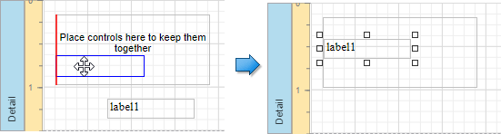
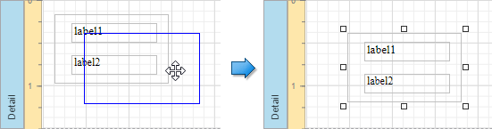
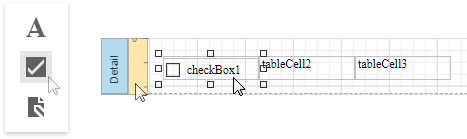

# Add Report Controls to Containers

The [Panel](../use-basic-report-controls/panel.md) control allows you to place various report controls on it to combine them into a group. 

You can use this panel to move, copy, change appearance settings, etc. instead of adjusting individual controls.

A [table cell](../use-tables.md) can also act as a container for other controls.

Both panel and table cell cannot contain the following report controls:
* [Cross Tab](../../create-reports/cross-tab-reports.md)
* [Subreport](../use-basic-report-controls/subreport.md)
* [Page Break](../use-basic-report-controls/page-break.md)
* [Table of Contents](../use-basic-report-controls/table-of-contents.md)
* [Cross-Band Line and Box](../draw-lines-and-shapes/draw-cross-band-lines-and-boxes.md)

If a panel or table cell includes only one control, you can position it within the container using the **Fit Bounds to Container** command. This command resizes the control so that it occupies all the available space (excluding borders).

