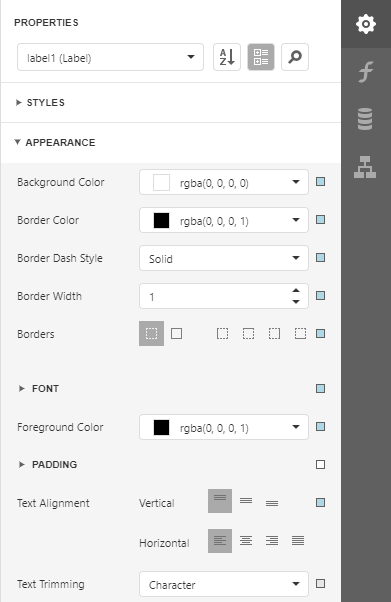
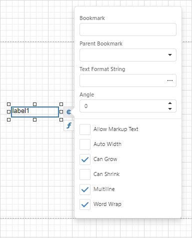

# Select Report Elements and Access Their Settings

You can click a report control or band to select it. 

Do one of the following to select multiple report controls:
* Press and hold the CTRL key and click the controls.
* Click an empty place on a report's surface and draw a rectangle around the controls.
    

Click the gray area around the design surface to select a report.

You can use the [Properties panel](../../report-designer-tools/ui-panels/properties-panel.md) to access the whole set of settings that the selected element supports.

Context menus provide quick access to actions for the selected report element. Right-click a report element to invoke the context menu:

When you select a report element (report, band, or report control), a smart tag and expression button are displayed next to the element on the Design Surface:

The smart tag opens a panel with the element’s most commonly used properties:

The smart tag contains properties from the element’s **Task** group of the Properties Panel. Note that complex properties (for example, **Symbology** for a **Barcode** control) need to be configured in the Properties Panel.