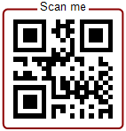
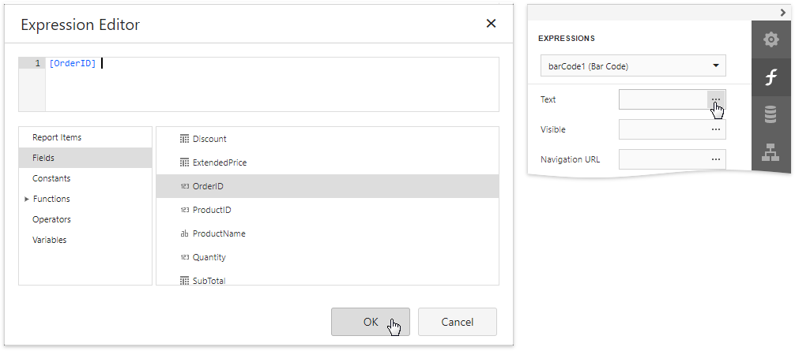
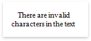

# Add Barcodes to a Report

## Overview

To insert a barcode into a report, drag the **Barcode** item from the [Toolbox](../../report-designer-tools/toolbox.md) onto the report's area.

After creating the barcode, expand the **Bar Code Tasks** category and select the barcode type (symbology) in the **Symbology** property's drop-down list.
	

	
After specifying the symbology, you can customize the type-specific options of the barcode, which are listed under the **Symbology** property.
	

## Main Options

To specify the bar width (a barcode's resolution), use the following options:
	
* Automatically calculate the bar width according to a barcode's dimensions by enabling the **Auto Module** option;
* Provide a fixed bar width value using the **Module** property.

The following are some additional barcode options:
	
* Use the barcode's **Text** property to provide accompanying text. The **Show Text** property allows you to show or hide this text.

* Use the **Orientation** property to rotate a barcode.

* Use the **Padding** property to specify the indent between bars and the barcode's inner boundaries.

## Frames for QR Codes

For QR Codes ([QR Code](qr-code.md), [GS1 QR Code](gs1-qr-code.md), and [EPC QR Code](epc-qr-code.md)), you can use the **Frame Options** property to configure the frame around the barcode. The Corner and Rectangle frames are available for all types of QR Codes. 

### Corner Frame

The corner frame looks as follows:

You can specify the following properties for corner frames:

  * **Frame Color**	

  	Specifies the frame color.

  * **Frame Width**

  	Specifies the frame width in pixels. 

  * **Padding**

  	Specifies the distance between the frame and QR code.

  * **Text**	

  	Specifies the text that displayed in the frame.

  * **Text Alignment**

  	Specifies how the text is aligned with the frame line.

  * **Text Color**	

  	Specifies the color of the text in the frame.

  * **Text Position**	

  	Specifies how the text is positioned against the QR code. 

### Rectangular Frame

The rectangular frame looks as follows:

You can specify the following properties for corner frames:

  * **Corner Radius**	
  
  	Specifies rounded corners for the rectangular frame in pixels.

  * **Frame Color**	

  	Specifies the frame color.

  * **Frame Width**

  	Specifies the frame width in pixels. 

  * **Padding**

  	Specifies the distance between the frame and QR code.

  * **Text**	

  	Specifies the text that displayed in the frame.

  * **Text Alignment**

  	Specifies how the text is aligned with the frame line.

  * **Text Color**	

  	Specifies the color of the text in the frame.

  * **Text Position**	

  	Specifies how the text is positioned against the QR code. 

## Bind to Data

You can [bind](../bind-controls-to-data.md) the bar code's **Text** property to a data field obtained from a report's data source. Click the **Text** property's ellipsis button in the [Expressions](../../report-designer-tools/ui-panels/expressions-panel.md) panel. The invoked [Expression Editor](../../report-designer-tools/expression-editor.md) allows you to select a data field or construct a complex binding expression with two or more data fields.

## Common Errors
The following section explains how to work around the most frequently encountered errors related to the incorrect use of barcodes.

* The following error message is shown in place of the barcode if the control's dimensions are too small to fit the barcode with its specified resolution.
	
	
	
	To get rid of this error, enable the **Auto Module** property and/or increase the barcode's dimensions.

* The following error message appears when the data supplied to a barcode contains characters that are not supported by this barcode type.
	
	
	
	To avoid this error, supply data that applies to a particular barcode specification.
