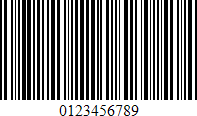
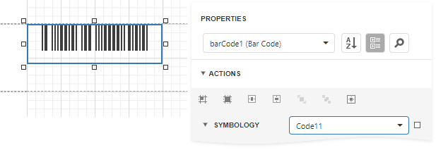

# Code 11 (USD-8)

**Code 11**, also known as **USD-8**, was developed as a high-density numerical-only symbology. It is used primarily in labeling telecommunications equipment.

The symbology is discrete and is able to encode the numbers **0** through to **9**, the dash symbol (**&#0045;**), and start/stop characters.

## Add the Barcode to a Report

1. Drag the **Barcode** item from the report controls toolbox tab and drop it onto the report. 

    

2. Set the control’s **Symbology** property to **Code11**. 

    

3. Specify [common](add-bar-codes-to-a-report.md) barcode properties.