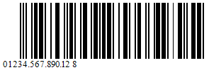
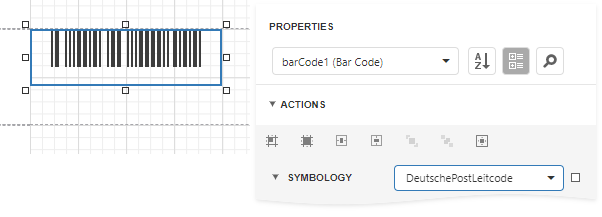

# Deutsche Post Leitcode

The *Deutsche Post Leitcode* symbology, or German Postal 2 of 5 LeitCode, LeitCode, or CodeLeitcode, is used by Deutsche Post AG (Deutsche Frachtpost).
This barcode identifies the destination.

A value that the barcode encodes should consist of 13 or 14 digits:

* 5 digits for a Postal Code (Postleitzahl, PLZ);
* 3 digits for a Street ID/number;
* 3 digits for a House number;
* 2 digits for a Product code;
* 1 digit for a checksum (optional).

When you specify 13 digits, the barcode generates a checksum digit automatically. If you add a checksum digit, the barcode ignores this digit and also generates it automatically to ensure the encoded value is valid.

## Add the Barcode to a Report

1. Drag the **Barcode** item from the report controls toolbox tab and drop it onto the report. 

    

2. Set the control’s **Symbology** property to **DeutschePostLeitcode**. 

    

3. Specify [common](add-bar-codes-to-a-report.md) barcode properties.