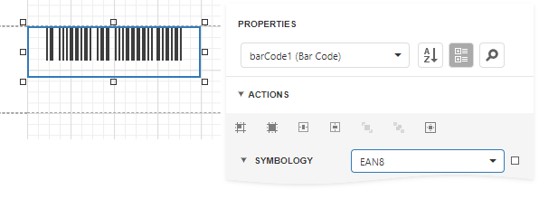

# EAN 8

**EAN-8** is the **EAN** equivalent of **UPC-E** in the sense that it provides a "short" barcode for small packages.

## Add the Barcode to a Report

1. Drag the **Barcode** item from the report controls toolbox tab and drop it onto the report. 

    

2. Set the control’s **Symbology** property to **EAN8**. 

    

3. Specify [common](add-bar-codes-to-a-report.md) barcode properties.